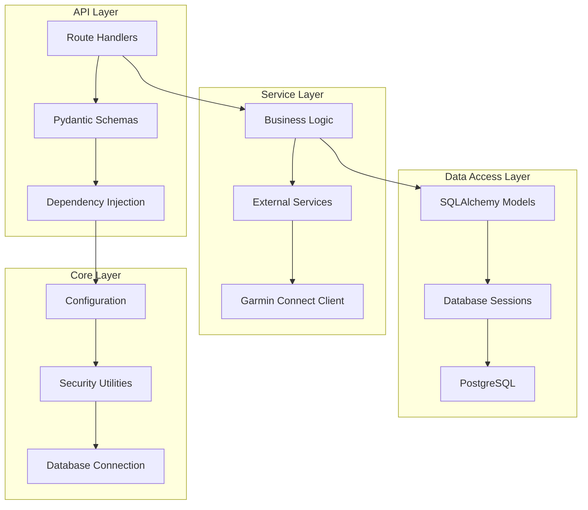

# Backend Architecture

**Version:** v1.1.0  
**Last Updated:** 2025-02-19  
**Author:** Development Team  
**Review Status:** Approved

## Overview

The backend is built with FastAPI, providing a high-performance async API server with automatic OpenAPI documentation. It follows a layered architecture pattern with clear separation of concerns.

## Architecture Layers



## Directory Structure

```
backend/
├── app/
│   ├── api/                 # API route handlers
│   │   ├── admin.py        # Admin endpoints (incl. database backup)
│   │   ├── athlete.py      # Athlete endpoints
│   │   ├── auth.py         # Authentication + profile update endpoints
│   │   ├── coach.py        # Coach endpoints
│   │   ├── garmin.py       # Garmin integration
│   │   ├── messaging.py    # Coach-athlete messaging
│   │   ├── public.py       # Public endpoints
│   │   └── deps.py         # Dependencies
│   ├── core/               # Core functionality
│   │   ├── config.py       # Settings management
│   │   ├── database.py     # Database setup
│   │   └── security.py     # Security utilities
│   ├── models/             # Database models
│   │   └── user.py         # User model
│   ├── services/           # Business services
│   │   └── garmin.py       # Garmin service
│   └── main.py            # FastAPI application
├── alembic/               # Database migrations
├── tests/                 # Test suite
└── requirements.txt       # Dependencies
```

## Key Components

### 1. FastAPI Application (`main.py`)

```python
# Lifespan management for startup/shutdown
@asynccontextmanager
async def lifespan(app: FastAPI):
    # Initialize database
    await init_db()
    # Create first admin
    await create_first_admin()
    # Seed default users (coach + athlete)
    await seed_default_users()
    yield
    # Cleanup
```

### 2. Configuration Management (`core/config.py`)

- Uses Pydantic Settings for type-safe configuration
- Environment variable loading with `.env` files
- Validation of required settings
- Separate configurations for development/production

### 3. Database Layer

#### Models (`models/user.py`)
- SQLAlchemy 2.0 with async support
- Declarative base models
- Relationship definitions
- Indexes and constraints

#### Database Sessions (`core/database.py`)
- Async session management
- Connection pooling
- Transaction handling
- Session dependency injection

### 4. API Layer

#### Route Organization
- **Public Routes**: No authentication required
- **Auth Routes**: Login, registration, token management
- **Role-Based Routes**: Protected by role dependencies
- **Admin Routes**: Admin-only access

#### Request/Response Models
- Pydantic schemas for validation
- Automatic serialization/deserialization
- Response model definitions
- Error response schemas

### 5. Service Layer

#### Garmin Service (`services/garmin.py`)
- Encapsulates Garmin Connect API interaction
- Credential encryption/decryption
- Workout data transformation
- Error handling and retry logic

### 6. Security Layer (`core/security.py`)

- JWT token creation/verification
- Password hashing with bcrypt
- Role-based access control
- Encryption utilities for sensitive data

## Design Patterns

### 1. Dependency Injection

FastAPI's dependency injection system is used for:
- Database sessions
- User authentication
- Role verification
- Request validation

### 2. Repository Pattern

While not explicitly implemented, the service layer acts as a repository:
- Abstracts data access
- Provides clean API to controllers
- Handles data transformation

### 3. Factory Pattern

Used in:
- Database session creation
- Encryption key generation
- Test data factories

## Async/Await Patterns

### Database Operations
All database operations are async:
```python
async def get_user(db: AsyncSession, user_id: int):
    result = await db.execute(select(User).where(User.id == user_id))
    return result.scalar_one_or_none()
```

### External API Calls
Garmin Connect integration is fully async:
```python
async def fetch_workouts(client: GarminClient):
    return await client.get_workouts()
```

## Error Handling

### Exception Hierarchy
```python
class TransformationCoachingException(Exception):
    """Base exception for the application"""

class AuthenticationError(TransformationCoachingException):
    """Authentication related errors"""

class GarminConnectionError(TransformationCoachingException):
    """Garmin API connection errors"""
```

### Response Format
Consistent error response format:
```python
{
    "detail": "Error message",
    "error_code": "ERROR_TYPE",
    "timestamp": "2024-01-01T00:00:00Z"
}
```

## Database Schema

### User Table
```sql
CREATE TABLE users (
    id SERIAL PRIMARY KEY,
    email VARCHAR(255) UNIQUE NOT NULL,
    hashed_password VARCHAR(255),
    full_name VARCHAR(255),
    role VARCHAR(50) NOT NULL,
    is_active BOOLEAN DEFAULT TRUE,
    is_verified BOOLEAN DEFAULT FALSE,
    created_at TIMESTAMP DEFAULT NOW(),
    updated_at TIMESTAMP DEFAULT NOW()
);
```

### Related Tables
- `garmin_credentials` - Encrypted Garmin credentials
- `shared_workouts` - Workout sharing relationships
- `contact_submissions` - Contact form submissions

## API Design Principles

### 1. RESTful Design
- Proper HTTP methods (GET, POST, PUT, DELETE)
- Resource-based URLs
- Status code compliance
- HATEOAS considerations

### 2. Versioning
- URL-based versioning (`/api/v1/`)
- Backward compatibility
- Deprecation strategy

### 3. Pagination
- Offset-based pagination
- Limit/offset parameters
- Total count in response
- Next/previous links

## Performance Optimizations

### 1. Database
- Connection pooling
- Query optimization
- Index usage
- Eager loading for relationships

### 2. Caching Strategy
- JWT token caching (in-memory)
- Garmin session caching
- Static response caching

### 3. Async Operations
- Non-blocking I/O
- Concurrent request handling
- Background tasks for heavy operations

## Testing Architecture

### Test Structure
```
tests/
├── conftest.py          # Test configuration
├── test_auth.py         # Authentication tests
├── test_admin.py        # Admin functionality
├── test_garmin.py       # Garmin integration
└── test_utils.py        # Test utilities
```

### Test Patterns
- Pytest with async support
- Factory Boy for test data
- HTTPX for async HTTP testing
- Database transaction rollback

## Security Implementation

### 1. Authentication
- JWT with RS256 signing
- Refresh token rotation
- Token blacklisting capability

### 2. Authorization
- Role-based access control
- Resource-level permissions
- API key authentication for services

### 3. Data Protection
- Field-level encryption
- PII detection and masking
- Audit logging

## Monitoring and Logging

### Logging Configuration
```python
LOGGING_CONFIG = {
    "version": 1,
    "disable_existing_loggers": False,
    "formatters": {
        "default": {
            "format": "%(asctime)s - %(name)s - %(levelname)s - %(message)s",
        },
    },
    "handlers": {
        "default": {
            "formatter": "default",
            "class": "logging.StreamHandler",
            "stream": "ext://sys.stdout",
        },
    },
    "root": {
        "level": "INFO",
        "handlers": ["default"],
    },
}
```

### Metrics Collection
- Request/response times
- Error rates
- Database query performance
- External API call success rates

## Future Enhancements

### 1. Microservices Migration
- Service extraction strategy
- API Gateway implementation
- Service discovery
- Inter-service communication

### 2. Event-Driven Architecture
- Event sourcing
- CQRS pattern
- Message queues (RabbitMQ/Redis)
- Event store implementation

### 3. Advanced Features
- GraphQL API
- WebSocket support
- Background job processing
- Distributed caching
