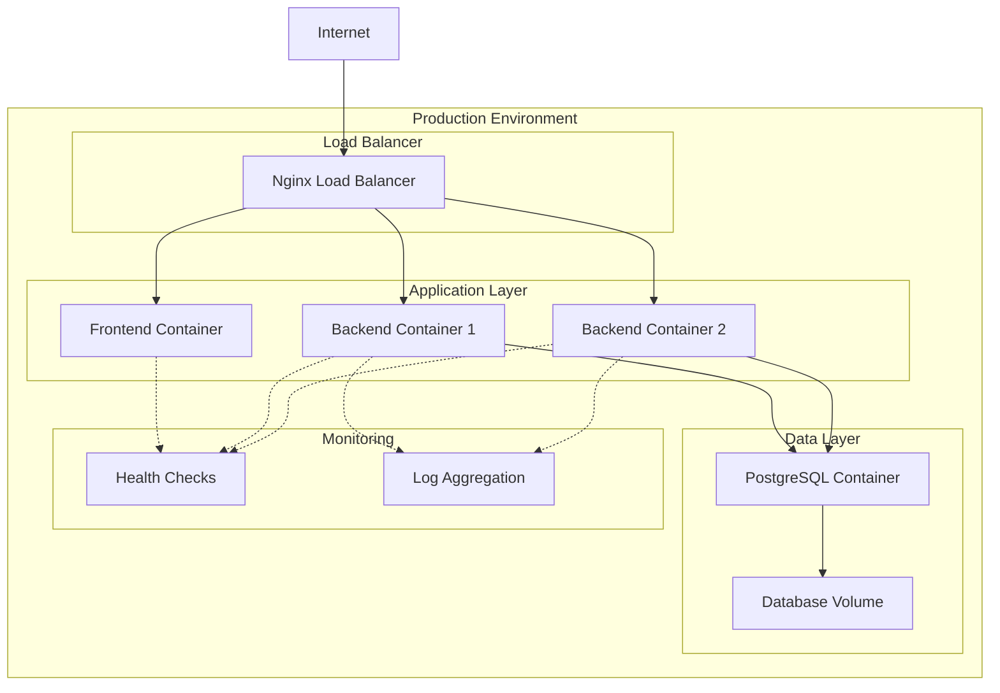

# Deployment Architecture

**Version:** v1.0.0  
**Last Updated:** 2025-02-17  
**Author:** Development Team  
**Review Status:** Approved

## Overview

The Transformation Coaching application is designed to be deployed using Docker containers with Docker Compose for orchestration. The architecture supports both development and production environments with minimal configuration changes.

## Deployment Architecture Diagram



## Container Architecture

### Development Environment

```yaml
# docker-compose.yml
version: '3.8'

services:
  # Frontend Development Server
  frontend:
    build:
      context: ./frontend
      dockerfile: Dockerfile
    ports:
      - "3000:3000"
    volumes:
      - ./frontend:/app
      - /app/node_modules
    environment:
      - REACT_APP_API_URL=http://localhost:8000
    depends_on:
      - backend

  # Backend Development Server
  backend:
    build:
      context: ./backend
      dockerfile: Dockerfile
    ports:
      - "8000:8000"
    volumes:
      - ./backend:/app
    environment:
      - DATABASE_URL=postgresql+asyncpg://tc_user:tc_password@db:5432/transformation_coaching
      - CORS_ORIGINS=http://localhost:3000
    depends_on:
      - db

  # PostgreSQL Database
  db:
    image: postgres:15-alpine
    ports:
      - "5432:5432"
    environment:
      - POSTGRES_DB=transformation_coaching
      - POSTGRES_USER=tc_user
      - POSTGRES_PASSWORD=tc_password
    volumes:
      - postgres_data:/var/lib/postgresql/data

volumes:
  postgres_data:
```

### Production Environment

```yaml
# docker-compose.prod.yml
version: '3.8'

services:
  # Nginx Reverse Proxy
  nginx:
    image: nginx:alpine
    ports:
      - "80:80"
      - "443:443"
    volumes:
      - ./nginx/nginx.conf:/etc/nginx/nginx.conf:ro
      - ./nginx/ssl:/etc/nginx/ssl:ro
      - frontend_build:/usr/share/nginx/html:ro
    depends_on:
      - frontend
      - backend
    restart: unless-stopped

  # Frontend Production Build
  frontend:
    build:
      context: ./frontend
      dockerfile: Dockerfile.prod
    volumes:
      - frontend_build:/app/build
    environment:
      - REACT_APP_API_URL=https://api.transformationcoaching.com
    restart: "no"

  # Backend Production Server
  backend:
    build:
      context: ./backend
      dockerfile: Dockerfile
    environment:
      - DATABASE_URL=${DATABASE_URL}
      - SECRET_KEY=${SECRET_KEY}
      - GARMIN_ENCRYPTION_KEY=${GARMIN_ENCRYPTION_KEY}
      - CORS_ORIGINS=https://transformationcoaching.com
    depends_on:
      - db
    restart: unless-stopped
    healthcheck:
      test: ["CMD", "curl", "-f", "http://localhost:8000/health"]
      interval: 30s
      timeout: 10s
      retries: 3

  # PostgreSQL Database
  db:
    image: postgres:15-alpine
    environment:
      - POSTGRES_DB=${POSTGRES_DB}
      - POSTGRES_USER=${POSTGRES_USER}
      - POSTGRES_PASSWORD=${POSTGRES_PASSWORD}
    volumes:
      - postgres_data:/var/lib/postgresql/data
      - ./backups:/backups
    restart: unless-stopped
    healthcheck:
      test: ["CMD-SHELL", "pg_isready -U ${POSTGRES_USER}"]
      interval: 30s
      timeout: 10s
      retries: 3

volumes:
  postgres_data:
  frontend_build:
```

## Dockerfile Configurations

### Backend Dockerfile

```dockerfile
# backend/Dockerfile
FROM python:3.11-slim

# Security: Create non-root user
RUN groupadd -r appuser && useradd -r -g appuser appuser

# Set working directory
WORKDIR /app

# Install system dependencies
RUN apt-get update && apt-get install -y \
    gcc \
    && rm -rf /var/lib/apt/lists/*

# Copy requirements first for layer caching
COPY requirements.txt .
RUN pip install --no-cache-dir -r requirements.txt

# Copy application code
COPY . .

# Change ownership
RUN chown -R appuser:appuser /app
USER appuser

# Health check
HEALTHCHECK --interval=30s --timeout=10s --start-period=5s --retries=3 \
    CMD curl -f http://localhost:8000/health || exit 1

# Expose port
EXPOSE 8000

# Start command
CMD ["uvicorn", "app.main:app", "--host", "0.0.0.0", "--port", "8000"]
```

### Frontend Dockerfile (Development)

```dockerfile
# frontend/Dockerfile
FROM node:18-alpine

# Set working directory
WORKDIR /app

# Copy package files
COPY package*.json ./

# Install dependencies
RUN npm ci --only=production

# Copy source code
COPY . .

# Expose port
EXPOSE 3000

# Start command
CMD ["npm", "start"]
```

### Frontend Dockerfile (Production)

```dockerfile
# frontend/Dockerfile.prod
FROM node:18-alpine as builder

WORKDIR /app

# Copy package files
COPY package*.json ./

# Install all dependencies
RUN npm ci

# Copy source code
COPY . .

# Build the application
RUN npm run build

# Production stage
FROM nginx:alpine

# Copy built application
COPY --from=builder /app/build /usr/share/nginx/html

# Copy nginx configuration
COPY nginx.conf /etc/nginx/conf.d/default.conf

# Expose port
EXPOSE 80

# Start nginx
CMD ["nginx", "-g", "daemon off;"]
```

## Nginx Configuration

### Production Nginx Config

```nginx
# nginx/nginx.conf
events {
    worker_connections 1024;
}

http {
    upstream backend {
        server backend:8000;
    }

    # Rate limiting
    limit_req_zone $binary_remote_addr zone=api:10m rate=10r/s;
    limit_req_zone $binary_remote_addr zone=login:10m rate=1r/s;

    server {
        listen 80;
        server_name transformationcoaching.com www.transformationcoaching.com;
        
        # Redirect to HTTPS
        return 301 https://$server_name$request_uri;
    }

    server {
        listen 443 ssl http2;
        server_name transformationcoaching.com www.transformationcoaching.com;

        # SSL configuration
        ssl_certificate /etc/nginx/ssl/cert.pem;
        ssl_certificate_key /etc/nginx/ssl/key.pem;
        ssl_protocols TLSv1.2 TLSv1.3;
        ssl_ciphers ECDHE-RSA-AES256-GCM-SHA512:DHE-RSA-AES256-GCM-SHA512;

        # Security headers
        add_header X-Frame-Options DENY;
        add_header X-Content-Type-Options nosniff;
        add_header X-XSS-Protection "1; mode=block";
        add_header Strict-Transport-Security "max-age=31536000; includeSubDomains";

        # Frontend static files
        location / {
            root /usr/share/nginx/html;
            index index.html index.htm;
            try_files $uri $uri/ /index.html;
            
            # Cache static assets
            location ~* \.(js|css|png|jpg|jpeg|gif|ico|svg)$ {
                expires 1y;
                add_header Cache-Control "public, immutable";
            }
        }

        # API proxy
        location /api/ {
            limit_req zone=api burst=20 nodelay;
            
            proxy_pass http://backend;
            proxy_set_header Host $host;
            proxy_set_header X-Real-IP $remote_addr;
            proxy_set_header X-Forwarded-For $proxy_add_x_forwarded_for;
            proxy_set_header X-Forwarded-Proto $scheme;
            
            # Timeouts
            proxy_connect_timeout 5s;
            proxy_send_timeout 10s;
            proxy_read_timeout 10s;
        }

        # Auth endpoints with stricter rate limiting
        location /api/v1/auth/login {
            limit_req zone=login burst=5 nodelay;
            
            proxy_pass http://backend;
            proxy_set_header Host $host;
            proxy_set_header X-Real-IP $remote_addr;
            proxy_set_header X-Forwarded-For $proxy_add_x_forwarded_for;
            proxy_set_header X-Forwarded-Proto $scheme;
        }

        # Health check endpoint
        location /health {
            access_log off;
            proxy_pass http://backend;
        }
    }
}
```

## Environment Configuration

### Environment Variables

```bash
# .env.production
# Database
DATABASE_URL=postgresql+asyncpg://tc_user:strong_password@db:5432/transformation_coaching
POSTGRES_DB=transformation_coaching
POSTGRES_USER=tc_user
POSTGRES_PASSWORD=strong_password

# Security
SECRET_KEY=your-super-secret-jwt-key-here
GARMIN_ENCRYPTION_KEY=your-fernet-encryption-key-here

# Admin User
FIRST_ADMIN_EMAIL=admin
FIRST_ADMIN_PASSWORD=FFester1!

# OAuth (Optional)
GOOGLE_CLIENT_ID=your-google-client-id
GOOGLE_CLIENT_SECRET=your-google-client-secret

# CORS
CORS_ORIGINS=https://transformationcoaching.com

# Frontend
REACT_APP_API_URL=https://api.transformationcoaching.com
```

## Deployment Process

### 1. Initial Setup

```bash
# Clone repository
git clone https://github.com/wjeiv/transformation-coaching.git
cd transformation-coaching

# Create environment file
cp backend/.env.example backend/.env
# Edit .env with production values

# Create SSL directory
mkdir -p nginx/ssl
# Place SSL certificates in nginx/ssl/
```

### 2. Deployment Commands

```bash
# Build and start production containers
docker-compose -f docker-compose.prod.yml up --build -d

# Run database migrations
docker-compose -f docker-compose.prod.yml exec backend alembic upgrade head

# Check service status
docker-compose -f docker-compose.prod.yml ps

# View logs
docker-compose -f docker-compose.prod.yml logs -f
```

### 3. Database Management

```bash
# Create database backup
docker-compose -f docker-compose.prod.yml exec db pg_dump \
    -U tc_user transformation_coaching > backup_$(date +%Y%m%d_%H%M%S).sql

# Restore database
docker-compose -f docker-compose.prod.yml exec -T db psql \
    -U tc_user transformation_coaching < backup_file.sql

# Access database
docker-compose -f docker-compose.prod.yml exec db psql \
    -U tc_user transformation_coaching
```

## Scaling Considerations

### Horizontal Scaling

```yaml
# docker-compose.scale.yml
version: '3.8'

services:
  backend:
    deploy:
      replicas: 3
    
  nginx:
    image: nginx:alpine
    volumes:
      - ./nginx/nginx.scale.conf:/etc/nginx/nginx.conf:ro
```

### Load Balancer Configuration

```nginx
# nginx/nginx.scale.conf
upstream backend {
    least_conn;
    server backend_1:8000;
    server backend_2:8000;
    server backend_3:8000;
}
```

## Monitoring and Logging

### Health Checks

```python
# Backend health check endpoint
@app.get("/health")
async def health_check():
    return {
        "status": "healthy",
        "timestamp": datetime.utcnow(),
        "version": "1.0.0",
        "database": await check_database_connection()
    }
```

### Log Aggregation

```yaml
# Add to docker-compose.prod.yml
  logging:
    driver: "json-file"
    options:
      max-size: "10m"
      max-file: "3"
```

### Monitoring Stack (Optional)

```yaml
# docker-compose.monitoring.yml
version: '3.8'

services:
  prometheus:
    image: prom/prometheus
    ports:
      - "9090:9090"
    volumes:
      - ./monitoring/prometheus.yml:/etc/prometheus/prometheus.yml

  grafana:
    image: grafana/grafana
    ports:
      - "3001:3000"
    environment:
      - GF_SECURITY_ADMIN_PASSWORD=admin
    volumes:
      - grafana_data:/var/lib/grafana

volumes:
  grafana_data:
```

## Security Considerations

### 1. Container Security

```dockerfile
# Security best practices in Dockerfile
FROM python:3.11-slim

# Use non-root user
RUN groupadd -r appuser && useradd -r -g appuser appuser

# Minimal base image
RUN apt-get update && apt-get install -y --no-install-recommends \
    gcc \
    && rm -rf /var/lib/apt/lists/* \
    && apt-get clean

# Clean up
USER appuser
```

### 2. Network Security

```yaml
# Docker networks
networks:
  frontend:
    driver: bridge
  backend:
    driver: bridge
    internal: true  # No internet access
  database:
    driver: bridge
    internal: true
```

### 3. Secrets Management

```bash
# Use Docker secrets (for Docker Swarm)
echo "my-secret-key" | docker secret create db_password -

# In docker-compose.yml
secrets:
  db_password:
    external: true
```

## Backup and Recovery

### Automated Backup Script

```bash
#!/bin/bash
# backup.sh

DATE=$(date +%Y%m%d_%H%M%S)
BACKUP_DIR="/backups"

# Database backup
docker-compose exec -T db pg_dump \
    -U tc_user transformation_coaching \
    > $BACKUP_DIR/db_backup_$DATE.sql

# Compress backup
gzip $BACKUP_DIR/db_backup_$DATE.sql

# Remove old backups (keep last 7 days)
find $BACKUP_DIR -name "db_backup_*.sql.gz" -mtime +7 -delete

# Upload to cloud storage (optional)
# aws s3 cp $BACKUP_DIR/db_backup_$DATE.sql.gz s3://my-backup-bucket/
```

### Recovery Process

```bash
# Stop application
docker-compose -f docker-compose.prod.yml down

# Restore database
docker-compose -f docker-compose.prod.yml up -d db
docker-compose -f docker-compose.prod.yml exec -T db psql \
    -U tc_user transformation_coaching < backup_file.sql

# Start application
docker-compose -f docker-compose.prod.yml up -d
```

## CI/CD Integration

### GitHub Actions Example

```yaml
# .github/workflows/deploy.yml
name: Deploy to Production

on:
  push:
    branches: [main]

jobs:
  deploy:
    runs-on: ubuntu-latest
    steps:
      - uses: actions/checkout@v2
      
      - name: Deploy to server
        uses: appleboy/ssh-action@v0.1.4
        with:
          host: ${{ secrets.HOST }}
          username: ${{ secrets.USERNAME }}
          key: ${{ secrets.SSH_KEY }}
          script: |
            cd /opt/transformation-coaching
            git pull origin main
            docker-compose -f docker-compose.prod.yml up --build -d
            docker-compose -f docker-compose.prod.yml exec backend alembic upgrade head
```

## Troubleshooting

### Common Issues

1. **Container won't start**
   ```bash
   # Check logs
   docker-compose logs [service_name]
   
   # Check configuration
   docker-compose config
   ```

2. **Database connection failed**
   ```bash
   # Check if database is ready
   docker-compose exec db pg_isready
   
   # Check network connectivity
   docker-compose exec backend ping db
   ```

3. **High memory usage**
   ```bash
   # Monitor resource usage
   docker stats
   
   # Clean up unused resources
   docker system prune -a
   ```

### Performance Tuning

1. **Database Optimization**
   - Configure appropriate shared_buffers
   - Enable connection pooling
   - Monitor slow queries

2. **Application Performance**
   - Adjust worker processes
   - Enable caching
   - Optimize image sizes

3. **Network Optimization**
   - Use overlay networks
   - Enable compression
   - Configure timeouts properly
