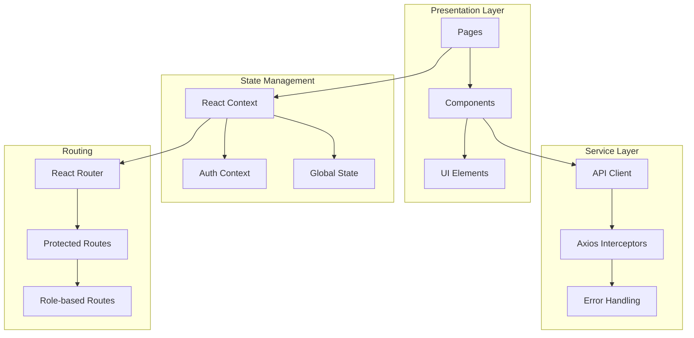

# Frontend Architecture

**Version:** v1.0.0  
**Last Updated:** 2025-02-17  
**Author:** Development Team  
**Review Status:** Approved

## Overview

The frontend is built with React 18 and TypeScript, providing a type-safe, component-based user interface. It follows modern React patterns with hooks, functional components, and a clear separation of concerns.

## Architecture Overview



## Directory Structure

```
frontend/src/
├── components/          # Reusable UI components
│   ├── common/         # Generic components
│   ├── forms/          # Form components
│   └── layout/         # Layout components
├── context/           # React contexts
│   └── AuthContext.tsx
├── pages/             # Page components
│   ├── AdminDashboard.tsx
│   ├── AthleteDashboard.tsx
│   ├── CoachDashboard.tsx
│   ├── LandingPage.tsx
│   ├── LoginPage.tsx
│   ├── RegisterPage.tsx
│   └── SettingsPage.tsx
├── services/          # API and external services
│   └── api.ts
├── types/             # TypeScript type definitions
├── utils/             # Utility functions
├── hooks/             # Custom React hooks
└── styles/            # Global styles and CSS
```

## Key Components

### 1. Application Entry Point (`App.tsx`)

```typescript
// Main application component with routing
function App() {
  return (
    <Router>
      <AuthProvider>
        <Routes>
          {/* Public routes */}
          <Route path="/" element={<LandingPage />} />
          <Route path="/login" element={<LoginPage />} />
          
          {/* Protected routes */}
          <Route element={<ProtectedRoute />}>
            <Route path="/dashboard" element={<DashboardRouter />} />
          </Route>
        </Routes>
      </AuthProvider>
    </Router>
  );
}
```

### 2. Authentication Context (`context/AuthContext.tsx`)

```typescript
interface AuthContextType {
  user: User | null;
  token: string | null;
  login: (credentials: LoginCredentials) => Promise<void>;
  logout: () => void;
  refreshToken: () => Promise<void>;
  isLoading: boolean;
}

const AuthContext = createContext<AuthContextType | undefined>(undefined);
```

### 3. API Service Layer (`services/api.ts`)

```typescript
// Axios instance with interceptors
const api = axios.create({
  baseURL: process.env.REACT_APP_API_URL,
  timeout: 10000,
});

// Request interceptor for auth token
api.interceptors.request.use((config) => {
  const token = localStorage.getItem('access_token');
  if (token) {
    config.headers.Authorization = `Bearer ${token}`;
  }
  return config;
});

// Response interceptor for token refresh
api.interceptors.response.use(
  (response) => response,
  async (error) => {
    if (error.response?.status === 401) {
      await refreshToken();
      return api.request(error.config);
    }
    return Promise.reject(error);
  }
);
```

## Design Patterns

### 1. Component Composition

```typescript
// Compound component pattern
const Card = ({ children, className }: CardProps) => {
  return <div className={cn("card", className)}>{children}</div>;
};

Card.Header = ({ children }: { children: React.ReactNode }) => {
  return <div className="card-header">{children}</div>;
};

Card.Body = ({ children }: { children: React.ReactNode }) => {
  return <div className="card-body">{children}</div>;
};

// Usage
<Card>
  <Card.Header>Title</Card.Header>
  <Card.Body>Content</Card.Body>
</Card>
```

### 2. Custom Hooks

```typescript
// Custom hook for API calls
function useApi<T>(url: string, dependencies: any[] = []) {
  const [data, setData] = useState<T | null>(null);
  const [loading, setLoading] = useState(true);
  const [error, setError] = useState<string | null>(null);

  useEffect(() => {
    fetchData();
  }, dependencies);

  const fetchData = async () => {
    try {
      setLoading(true);
      const response = await api.get(url);
      setData(response.data);
    } catch (err) {
      setError(err.message);
    } finally {
      setLoading(false);
    }
  };

  return { data, loading, error };
}
```

### 3. Render Props Pattern

```typescript
// Data provider component
const DataProvider = ({ url, children }: DataProviderProps) => {
  const { data, loading, error } = useApi(url);
  
  return children({ data, loading, error });
};

// Usage
<DataProvider url="/api/v1/user/profile">
  {({ data, loading, error }) => {
    if (loading) return <Spinner />;
    if (error) return <ErrorMessage error={error} />;
    return <UserProfile data={data} />;
  }}
</DataProvider>
```

## State Management

### 1. Local State
- useState for component state
- useReducer for complex state logic
- useRef for DOM references

### 2. Global State
- React Context for authentication
- Context for theme preferences
- Context for application settings

### 3. Server State
- React Query (future enhancement)
- SWR for data fetching
- Local storage for persistence

## Routing Architecture

### 1. Route Structure

```typescript
// Public routes
const publicRoutes = [
  { path: '/', component: LandingPage },
  { path: '/login', component: LoginPage },
  { path: '/register', component: RegisterPage },
];

// Protected routes
const protectedRoutes = [
  { 
    path: '/dashboard/admin', 
    component: AdminDashboard,
    roles: ['ADMIN']
  },
  { 
    path: '/dashboard/coach', 
    component: CoachDashboard,
    roles: ['COACH']
  },
  { 
    path: '/dashboard/athlete', 
    component: AthleteDashboard,
    roles: ['ATHLETE']
  },
];
```

### 2. Route Guards

```typescript
const ProtectedRoute = ({ children, roles }: ProtectedRouteProps) => {
  const { user } = useAuth();
  
  if (!user) {
    return <Navigate to="/login" replace />;
  }
  
  if (roles && !roles.includes(user.role)) {
    return <Navigate to="/unauthorized" replace />;
  }
  
  return children;
};
```

## Component Architecture

### 1. Atomic Design Pattern

```
components/
├── atoms/          # Smallest units (buttons, inputs)
├── molecules/      # Simple groups (search box, form field)
├── organisms/      # Complex sections (header, sidebar)
└── templates/      # Page layouts
```

### 2. Component Types

```typescript
// Presentational component
interface ButtonProps {
  children: React.ReactNode;
  variant: 'primary' | 'secondary';
  onClick: () => void;
}

const Button: React.FC<ButtonProps> = ({ children, variant, onClick }) => {
  return (
    <button 
      className={cn('btn', `btn-${variant}`)}
      onClick={onClick}
    >
      {children}
    </button>
  );
};

// Container component
const UserList: React.FC = () => {
  const { data: users, loading } = useApi('/api/v1/users');
  
  if (loading) return <Spinner />;
  
  return (
    <div>
      {users?.map(user => (
        <UserCard key={user.id} user={user} />
      ))}
    </div>
  );
};
```

## Styling Architecture

### 1. Tailwind CSS Configuration

```javascript
// tailwind.config.js
module.exports = {
  content: ['./src/**/*.{js,jsx,ts,tsx}'],
  theme: {
    extend: {
      colors: {
        primary: {
          50: '#eff6ff',
          500: '#3b82f6',
          900: '#1e3a8a',
        },
      },
      fontFamily: {
        sans: ['Inter', 'sans-serif'],
      },
    },
  },
  plugins: [
    require('@tailwindcss/forms'),
    require('@tailwindcss/typography'),
  ],
};
```

### 2. Component Styling Strategy

```typescript
// Utility-first approach
const Card = ({ className, children }: CardProps) => {
  return (
    <div className={cn(
      'bg-white rounded-lg shadow-md p-6',
      className
    )}>
      {children}
    </div>
  );
};

// CSS-in-JS for dynamic styles
const ProgressBar = ({ progress }: { progress: number }) => {
  return (
    <div 
      className="bg-blue-500 h-2 rounded-full transition-all"
      style={{ width: `${progress}%` }}
    />
  );
};
```

## Error Handling

### 1. Error Boundaries

```typescript
class ErrorBoundary extends React.Component<
  { children: React.ReactNode },
  { hasError: boolean }
> {
  constructor(props: any) {
    super(props);
    this.state = { hasError: false };
  }

  static getDerivedStateFromError(error: Error) {
    return { hasError: true };
  }

  componentDidCatch(error: Error, errorInfo: React.ErrorInfo) {
    console.error('Error caught by boundary:', error, errorInfo);
  }

  render() {
    if (this.state.hasError) {
      return <ErrorFallback />;
    }

    return this.props.children;
  }
}
```

### 2. API Error Handling

```typescript
// Global error handler
const handleApiError = (error: AxiosError) => {
  if (error.response?.status === 401) {
    // Handle unauthorized
    logout();
  } else if (error.response?.status >= 500) {
    // Handle server errors
    toast.error('Server error. Please try again later.');
  } else {
    // Handle other errors
    toast.error(error.response?.data?.detail || 'An error occurred');
  }
};
```

## Performance Optimizations

### 1. Code Splitting

```typescript
// Lazy loading components
const AdminDashboard = lazy(() => import('./pages/AdminDashboard'));
const CoachDashboard = lazy(() => import('./pages/CoachDashboard'));

// Route-based splitting
<Route 
  path="/dashboard/admin" 
  element={
    <Suspense fallback={<Spinner />}>
      <AdminDashboard />
    </Suspense>
  } 
/>
```

### 2. Memoization

```typescript
// React.memo for component memoization
const UserCard = React.memo(({ user }: UserCardProps) => {
  return (
    <Card>
      <h3>{user.name}</h3>
      <p>{user.email}</p>
    </Card>
  );
});

// useMemo for expensive calculations
const ExpensiveComponent = ({ data }: Props) => {
  const processedData = useMemo(() => {
    return data.map(processItem);
  }, [data]);

  return <DataList data={processedData} />;
};
```

### 3. Virtualization

```typescript
// For large lists
import { FixedSizeList as List } from 'react-window';

const VirtualizedList = ({ items }: { items: any[] }) => {
  const Row = ({ index, style }: any) => (
    <div style={style}>
      <ListItem item={items[index]} />
    </div>
  );

  return (
    <List
      height={600}
      itemCount={items.length}
      itemSize={80}
    >
      {Row}
    </List>
  );
};
```

## Testing Architecture

### 1. Test Structure

```
src/
├── components/
│   └── Button/
│       ├── Button.tsx
│       ├── Button.test.tsx
│       └── Button.stories.tsx
```

### 2. Testing Patterns

```typescript
// Component testing with React Testing Library
describe('Button', () => {
  it('renders with correct text', () => {
    render(<Button>Click me</Button>);
    expect(screen.getByRole('button', { name: 'Click me' })).toBeInTheDocument();
  });

  it('calls onClick when clicked', () => {
    const handleClick = jest.fn();
    render(<Button onClick={handleClick}>Click me</Button>);
    
    fireEvent.click(screen.getByRole('button'));
    expect(handleClick).toHaveBeenCalledTimes(1);
  });
});
```

## Accessibility

### 1. ARIA Implementation

```typescript
const AccessibleModal = ({ isOpen, onClose, children }: ModalProps) => {
  return (
    <Dialog 
      open={isOpen} 
      onClose={onClose}
      aria-labelledby="modal-title"
      aria-describedby="modal-description"
    >
      <DialogTitle id="modal-title">Modal Title</DialogTitle>
      <DialogContent>
        <DialogContentText id="modal-description">
          {children}
        </DialogContentText>
      </DialogContent>
    </Dialog>
  );
};
```

### 2. Keyboard Navigation

```typescript
const useKeyboardNavigation = (onEscape: () => void) => {
  useEffect(() => {
    const handleKeyDown = (event: KeyboardEvent) => {
      if (event.key === 'Escape') {
        onEscape();
      }
    };

    document.addEventListener('keydown', handleKeyDown);
    return () => document.removeEventListener('keydown', handleKeyDown);
  }, [onEscape]);
};
```

## Future Enhancements

### 1. State Management
- Redux Toolkit for complex state
- Zustand for lightweight state
- Jotai for atomic state management

### 2. Performance
- Service Workers for caching
- Web Workers for heavy computations
- Intersection Observer for lazy loading

### 3. Developer Experience
- Storybook for component development
- MSW for API mocking
- React DevTools Profiler integration
