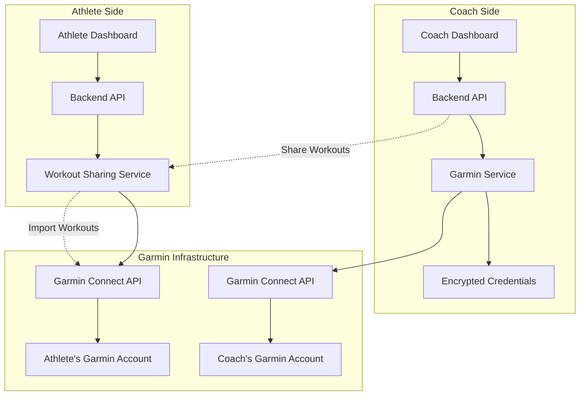
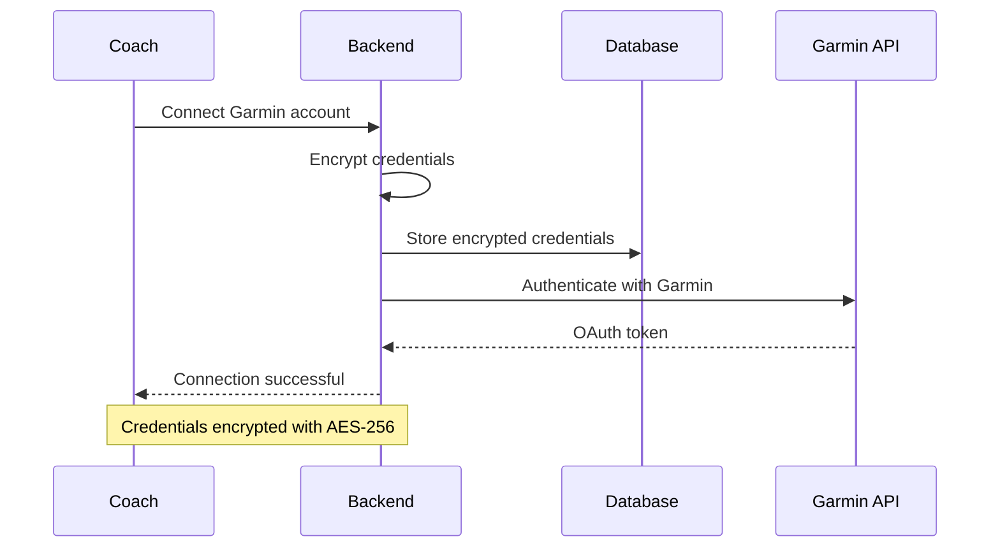
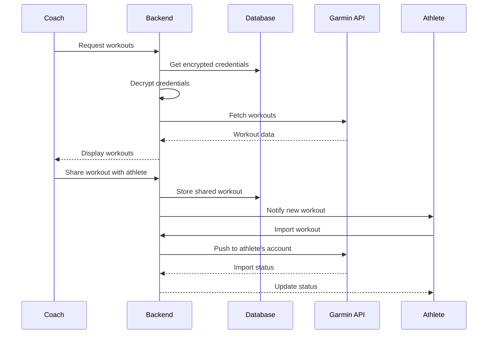
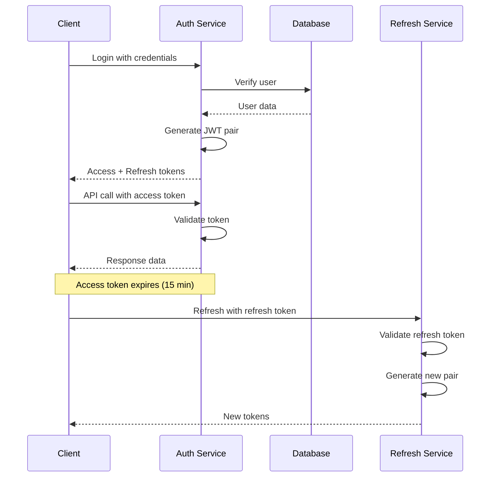
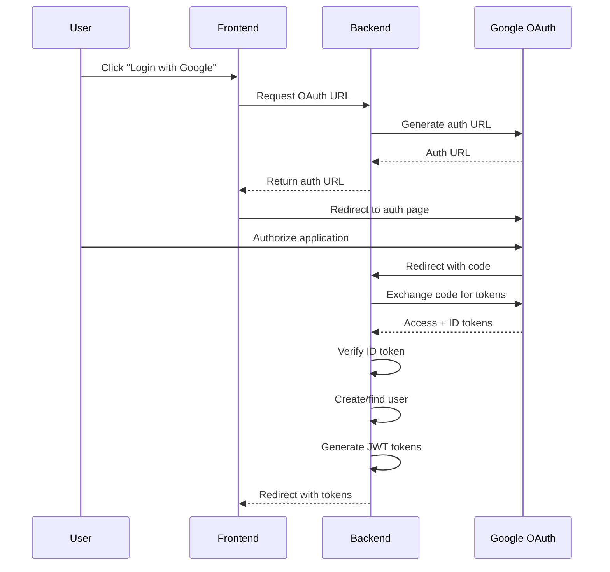

# Integration Patterns

**Version:** v1.0.0  
**Last Updated:** 2025-02-17  
**Author:** Development Team  
**Review Status:** Approved

## Overview

This document describes the integration patterns used in the Transformation Coaching application, focusing on Garmin Connect integration, authentication flows, and third-party service integrations.

## Garmin Connect Integration

### Architecture Overview



### Authentication Flow



### Workout Sharing Process



### Implementation Details

#### 1. Credential Encryption

```python
# Encryption service
from cryptography.fernet import Fernet

class CredentialEncryption:
    def __init__(self, key: bytes):
        self.cipher = Fernet(key)
    
    def encrypt(self, data: str) -> str:
        return self.cipher.encrypt(data.encode()).decode()
    
    def decrypt(self, encrypted_data: str) -> str:
        return self.cipher.decrypt(encrypted_data.encode()).decode()
```

#### 2. Garmin Service Client

```python
class GarminService:
    def __init__(self, email: str, password: str):
        self.client = GarminConnect(email, password)
    
    async def get_workouts(self, start_date: date, end_date: date):
        """Fetch workouts within date range"""
        await self.client.login()
        workouts = await self.client.get_workouts(start_date, end_date)
        return self._transform_workouts(workouts)
    
    async def share_workout(self, workout_id: str, athlete_email: str):
        """Share workout with athlete"""
        workout = await self.client.get_workout(workout_id)
        # Transform and prepare for sharing
        return self._prepare_shared_workout(workout)
```

#### 3. Error Handling

```python
class GarminIntegrationError(Exception):
    """Base exception for Garmin integration"""
    pass

class GarminAuthError(GarminIntegrationError):
    """Authentication failed"""
    pass

class GarminApiError(GarminIntegrationError):
    """API call failed"""
    def __init__(self, message: str, status_code: int = None):
        self.status_code = status_code
        super().__init__(message)
```

## Authentication Integration

### JWT Token Flow



### Google OAuth Integration



### Implementation

#### 1. JWT Service

```python
class JWTService:
    def __init__(self, secret_key: str, algorithm: str = "HS256"):
        self.secret_key = secret_key
        self.algorithm = algorithm
    
    def create_access_token(self, data: dict, expires_delta: timedelta):
        to_encode = data.copy()
        expire = datetime.utcnow() + expires_delta
        to_encode.update({"exp": expire, "type": "access"})
        return jwt.encode(to_encode, self.secret_key, algorithm=self.algorithm)
    
    def create_refresh_token(self, user_id: int):
        expire = datetime.utcnow() + timedelta(days=7)
        to_encode = {
            "sub": str(user_id),
            "exp": expire,
            "type": "refresh"
        }
        return jwt.encode(to_encode, self.secret_key, algorithm=self.algorithm)
```

#### 2. OAuth Configuration

```python
# Google OAuth settings
GOOGLE_CLIENT_ID = settings.GOOGLE_CLIENT_ID
GOOGLE_CLIENT_SECRET = settings.GOOGLE_CLIENT_SECRET
GOOGLE_REDIRECT_URI = settings.GOOGLE_REDIRECT_URI

# OAuth flow
async def google_oauth_callback(code: str):
    # Exchange code for tokens
    async with httpx.AsyncClient() as client:
        response = await client.post(
            "https://oauth2.googleapis.com/token",
            data={
                "code": code,
                "client_id": GOOGLE_CLIENT_ID,
                "client_secret": GOOGLE_CLIENT_SECRET,
                "redirect_uri": GOOGLE_REDIRECT_URI,
                "grant_type": "authorization_code"
            }
        )
        tokens = response.json()
    
    # Get user info
    id_token = tokens.get("id_token")
    user_info = jwt.decode(id_token, verify=False)
    
    return user_info
```

## Database Integration Patterns

### Connection Pool Management

```python
# Async connection pool
from sqlalchemy.ext.asyncio import create_async_engine, AsyncSession
from sqlalchemy.orm import sessionmaker

engine = create_async_engine(
    DATABASE_URL,
    pool_size=20,
    max_overflow=30,
    pool_pre_ping=True,
    pool_recycle=3600,
)

async_session = sessionmaker(
    engine, class_=AsyncSession, expire_on_commit=False
)

# Dependency injection
async def get_db():
    async with async_session() as session:
        try:
            yield session
        finally:
            await session.close()
```

### Transaction Management

```python
# Transaction decorator
async def transactional(func):
    async def wrapper(*args, **kwargs):
        async with async_session() as session:
            async with session.begin():
                return await func(session, *args, **kwargs)
    return wrapper

# Usage
@transactional
async def create_user_with_profile(session, user_data, profile_data):
    user = User(**user_data)
    session.add(user)
    await session.flush()  # Get user ID without committing
    
    profile = Profile(user_id=user.id, **profile_data)
    session.add(profile)
    return user
```

## External Service Integration

### Email Service Integration

```python
# Email service abstraction
class EmailService:
    def __init__(self, provider: str):
        self.provider = provider
    
    async def send_welcome_email(self, user_email: str, user_name: str):
        template = self._load_template("welcome.html")
        content = template.render(name=user_name)
        
        await self.provider.send_email(
            to=user_email,
            subject="Welcome to Transformation Coaching",
            html_content=content
        )

# SMTP implementation
class SMTPEmailProvider:
    async def send_email(self, to: str, subject: str, html_content: str):
        message = MIMEMultipart("alternative")
        message["Subject"] = subject
        message["From"] = SMTP_FROM
        message["To"] = to
        
        html_part = MIMEText(html_content, "html")
        message.attach(html_part)
        
        await self._send_via_smtp(message)
```

### File Storage Integration

```python
# Storage abstraction
class StorageService:
    def __init__(self, backend: str):
        self.backend = backend
    
    async def upload_file(self, file: UploadFile, path: str):
        """Upload file to storage backend"""
        return await self.backend.upload(file, path)
    
    async def get_file_url(self, path: str):
        """Get public URL for file"""
        return await self.backend.get_url(path)

# S3 implementation
class S3StorageBackend:
    def __init__(self, bucket: str, access_key: str, secret_key: str):
        self.bucket = bucket
        self.client = boto3.client(
            "s3",
            aws_access_key_id=access_key,
            aws_secret_access_key=secret_key
        )
    
    async def upload(self, file: UploadFile, path: str):
        content = await file.read()
        self.client.put_object(
            Bucket=self.bucket,
            Key=path,
            Body=content,
            ContentType=file.content_type
        )
        return f"s3://{self.bucket}/{path}"
```

## API Integration Patterns

### Rate Limiting

```python
# Rate limiting middleware
from slowapi import Limiter, _rate_limit_exceeded_handler
from slowapi.util import get_remote_address

limiter = Limiter(key_func=get_remote_address)

@app.middleware("http")
async def rate_limit_middleware(request: Request, call_next):
    # Apply rate limiting based on endpoint
    if request.url.path.startswith("/api/v1/garmin"):
        # Stricter limits for Garmin endpoints
        return await limiter.limit("10/minute")(call_next)(request)
    return await call_next(request)
```

### Circuit Breaker Pattern

```python
# Circuit breaker for external APIs
class CircuitBreaker:
    def __init__(self, failure_threshold: int = 5, timeout: int = 60):
        self.failure_threshold = failure_threshold
        self.timeout = timeout
        self.failure_count = 0
        self.last_failure_time = None
        self.state = "CLOSED"  # CLOSED, OPEN, HALF_OPEN
    
    async def call(self, func, *args, **kwargs):
        if self.state == "OPEN":
            if time.time() - self.last_failure_time > self.timeout:
                self.state = "HALF_OPEN"
            else:
                raise Exception("Circuit breaker is OPEN")
        
        try:
            result = await func(*args, **kwargs)
            if self.state == "HALF_OPEN":
                self.state = "CLOSED"
                self.failure_count = 0
            return result
        except Exception as e:
            self.failure_count += 1
            self.last_failure_time = time.time()
            if self.failure_count >= self.failure_threshold:
                self.state = "OPEN"
            raise e
```

## Event-Driven Integration

### Event Publishing

```python
# Event system for decoupled integration
class EventPublisher:
    def __init__(self):
        self.subscribers = {}
    
    def subscribe(self, event_type: str, handler: Callable):
        if event_type not in self.subscribers:
            self.subscribers[event_type] = []
        self.subscribers[event_type].append(handler)
    
    async def publish(self, event_type: str, data: dict):
        if event_type in self.subscribers:
            for handler in self.subscribers[event_type]:
                await handler(data)

# Usage
publisher = EventPublisher()

# Subscribe to events
@publisher.subscribe("user_registered")
async def send_welcome_email(data):
    await email_service.send_welcome_email(
        data["email"], 
        data["name"]
    )

@publisher.subscribe("workout_shared")
async def notify_athlete(data):
    await notification_service.send_push_notification(
        data["athlete_id"],
        "New workout shared by your coach"
    )
```

## Monitoring and Observability

### Integration Metrics

```python
# Metrics collection
class IntegrationMetrics:
    def __init__(self):
        self.counters = {}
        self.histograms = {}
    
    def increment_counter(self, name: str, tags: dict = None):
        key = self._make_key(name, tags)
        self.counters[key] = self.counters.get(key, 0) + 1
    
    def record_timing(self, name: str, duration: float, tags: dict = None):
        key = self._make_key(name, tags)
        if key not in self.histograms:
            self.histograms[key] = []
        self.histograms[key].append(duration)

# Usage in services
class GarminService:
    def __init__(self):
        self.metrics = IntegrationMetrics()
    
    async def get_workouts(self):
        start_time = time.time()
        try:
            result = await self._fetch_workouts()
            self.metrics.increment_counter("garmin.api.success", {"endpoint": "workouts"})
            return result
        except Exception as e:
            self.metrics.increment_counter("garmin.api.error", {"endpoint": "workouts"})
            raise
        finally:
            duration = time.time() - start_time
            self.metrics.record_timing("garmin.api.duration", duration)
```

## Best Practices

### 1. Security
- Always encrypt sensitive credentials at rest
- Use HTTPS for all external communications
- Implement proper token management
- Validate all external inputs

### 2. Reliability
- Implement retry logic with exponential backoff
- Use circuit breakers for external services
- Log all integration failures
- Monitor integration health

### 3. Performance
- Cache external API responses when appropriate
- Use async/await for I/O operations
- Implement connection pooling
- Batch requests when possible

### 4. Maintainability
- Abstract external services behind interfaces
- Use dependency injection for service configuration
- Implement comprehensive logging
- Document all integration contracts
