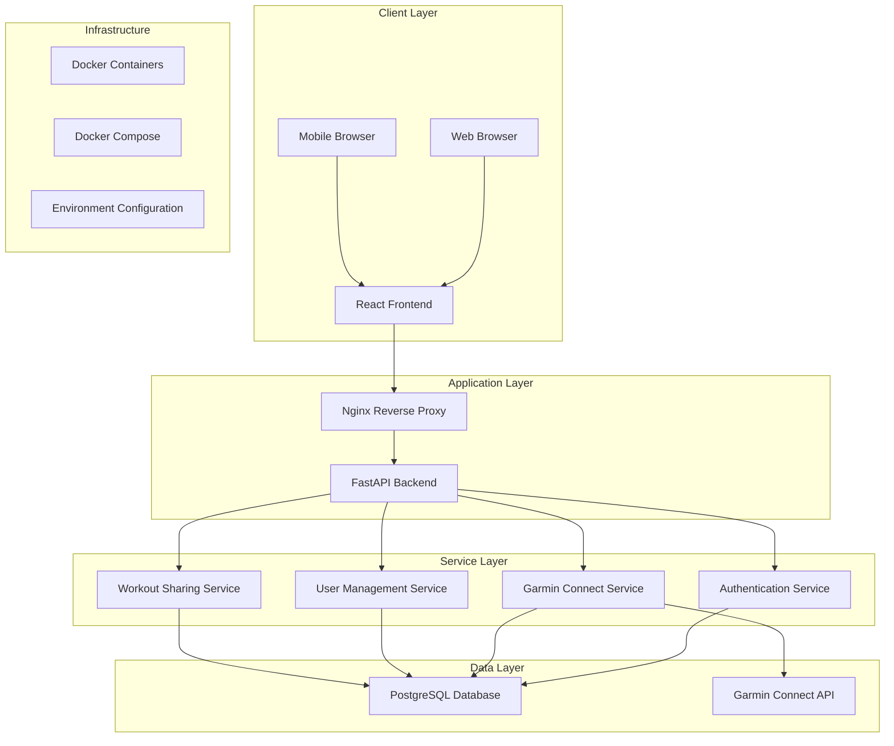
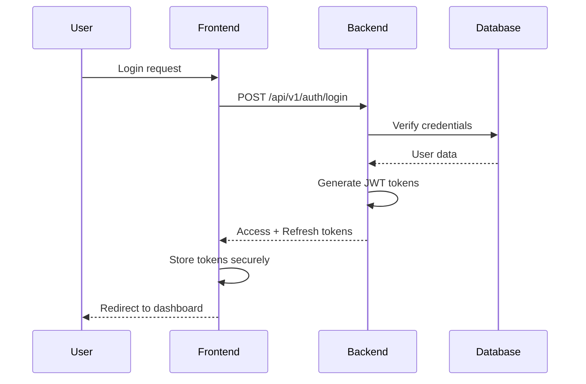
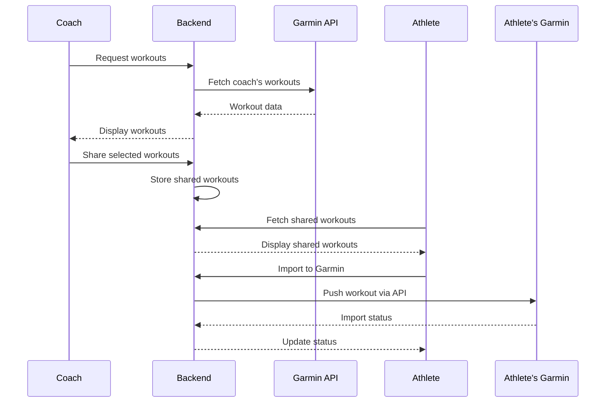

# System Architecture Overview

**Version:** v1.0.0  
**Last Updated:** 2025-02-17  
**Author:** Development Team  
**Review Status:** Approved

## High-Level Architecture



## Architecture Principles

### 1. **Separation of Concerns**
- Frontend handles UI/UX and user interactions
- Backend manages business logic and data persistence
- Services encapsulate specific domain functionality

### 2. **API-First Design**
- RESTful API design with OpenAPI documentation
- Clear contract between frontend and backend
- Versioned API endpoints for future compatibility

### 3. **Security by Default**
- JWT-based authentication with refresh tokens
- Role-based access control (RBAC)
- Encrypted storage of sensitive data (Garmin credentials)
- CORS configuration for cross-origin requests

### 4. **Scalability and Maintainability**
- Containerized deployment with Docker
- Async/await patterns for better performance
- Modular code structure
- Database migrations with Alembic

## Technology Stack

| Layer | Technology | Purpose |
|-------|------------|---------|
| Frontend | React 18, TypeScript, TailwindCSS | UI framework, type safety, styling |
| Backend | FastAPI, Python 3.11 | API framework, business logic |
| Database | PostgreSQL 15, SQLAlchemy | Data persistence, ORM |
| Authentication | JWT, bcrypt, OAuth 2.0 | Secure authentication |
| External APIs | Garmin Connect API | Workout data integration |
| Containerization | Docker, Docker Compose | Deployment and orchestration |
| Web Server | Nginx | Reverse proxy and static file serving |

## Data Flow

### Authentication Flow


### Workout Sharing Flow


## Security Architecture

### Authentication & Authorization
- **JWT Access Tokens**: 15-minute expiration
- **Refresh Tokens**: 7-day expiration with rotation
- **Role-Based Access**: Admin, Coach, Athlete roles
- **OAuth Integration**: Google OAuth for SSO

### Data Protection
- **Encryption at Rest**: AES-256 for Garmin credentials
- **Encryption in Transit**: HTTPS/TLS for all communications
- **Input Validation**: Pydantic models for request validation
- **SQL Injection Prevention**: SQLAlchemy ORM usage

### Infrastructure Security
- **Non-root Containers**: All containers run with non-root users
- **Network Isolation**: Docker networks for service isolation
- **Environment Variables**: Sensitive data in environment files
- **Health Checks**: Container health monitoring

## Deployment Architecture

### Development Environment
```yaml
Services:
  - Frontend (React Dev Server)
  - Backend (FastAPI with auto-reload)
  - Database (PostgreSQL)
  - Database Migrations (Alembic)
```

### Production Environment
```yaml
Services:
  - Nginx (Reverse Proxy + Static Files)
  - Backend (FastAPI)
  - Frontend (Built React build)
  - Database (PostgreSQL with persistence)
  - Health Checks
  - Restart Policies
```

## Monitoring and Observability

### Application Monitoring
- **Health Endpoints**: `/health` for service status
- **Logging**: Structured logging with levels
- **Error Tracking**: Centralized error logging
- **Performance Metrics**: Request/response times

### Database Monitoring
- **Connection Pooling**: Async connection management
- **Query Performance**: Slow query logging
- **Migration Tracking**: Alembic version tracking

## Future Considerations

### Scalability
- **Horizontal Scaling**: Multiple backend instances
- **Load Balancing**: Nginx load balancing
- **Database Scaling**: Read replicas, connection pooling
- **Caching**: Redis for session/data caching

### Enhancements
- **API Rate Limiting**: Prevent abuse
- **WebSocket Support**: Real-time notifications
- **Background Jobs**: Celery for async tasks
- **Analytics**: User behavior tracking
- **CDN Integration**: Static asset delivery

## Decision Log

| Decision | Date | Reason | Impact |
|----------|------|--------|--------|
| FastAPI over Django | 2024-01-15 | Better async support, automatic OpenAPI | Faster API development |
| PostgreSQL over MySQL | 2024-01-15 | Advanced features, better concurrency | Improved query performance |
| React over Vue.js | 2024-01-15 | Team familiarity, larger ecosystem | Faster development |
| Docker Compose | 2024-01-15 | Simple deployment, good for small teams | Easier local development |
