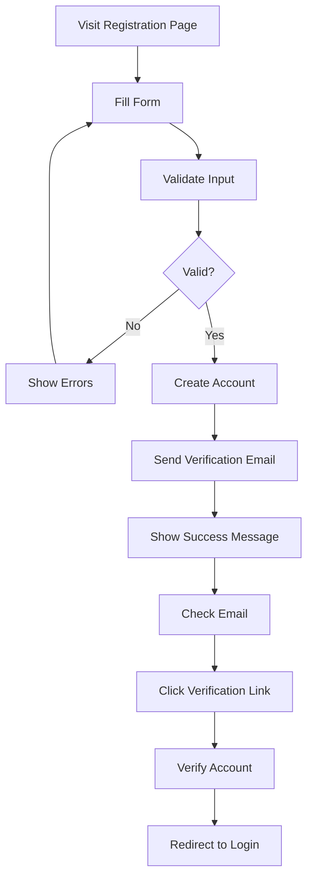
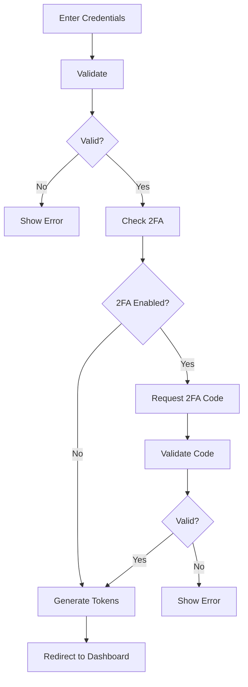

# Authentication Feature Specification

**Version:** v1.0.0  
**Last Updated:** 2025-02-17  
**Author:** Product Team  
**Review Status:** Approved

## Overview

The authentication system provides secure access to the Transformation Coaching platform through multiple authentication methods while maintaining a seamless user experience and robust security measures.

## User Stories

### As a user...
- I want to create an account with email and password so I can access the platform
- I want to sign in with Google so I don't have to remember another password
- I want to reset my password if I forget it so I can regain access
- I want to stay logged in for convenience but with security
- I want to log out completely when I'm done so my account is secure

### As an admin...
- I want to create accounts for coaches so I can onboard them efficiently
- I want to manage user roles so I can control access
- I want to disable accounts if needed so I can maintain security

## Feature Requirements

### AUTH-001: User Registration

**Description**: New user account creation with validation

**Requirements**:
- Registration form with fields:
  - Email address (required)
  - Password (required, with strength indicator)
  - Confirm password (required)
  - Full name (required)
  - Role selection (athlete only, admin creates coaches)
- Real-time validation feedback
- Password strength meter with requirements:
  - Minimum 8 characters
  - At least one uppercase letter
  - At least one lowercase letter
  - At least one number
  - At least one special character
- Email verification required before account activation
- Terms of service and privacy policy agreement
- Success message with verification instructions

**Acceptance Criteria**:
- Duplicate email addresses are rejected with clear message
- Password requirements are clearly communicated
- Email verification link expires after 24 hours
- User cannot log in until email is verified
- Registration works on all devices

### AUTH-002: Email Login

**Description**: Traditional email and password authentication

**Requirements**:
- Login form with:
  - Email address
  - Password
  - "Remember me" checkbox (7-day session)
  - "Forgot password" link
- Password visibility toggle
- Error messages for:
  - Invalid credentials
  - Unverified email
  - Locked account
- Rate limiting: 5 attempts per 15 minutes
- Session management with JWT tokens
- Automatic redirect to appropriate dashboard

**Acceptance Criteria**:
- Login works with valid credentials
- Invalid credentials show generic error message
- Account locks after 5 failed attempts
- "Remember me" extends session to 7 days
- Successful login redirects to correct dashboard

### AUTH-003: Google OAuth Integration

**Description**: Authentication using Google accounts

**Requirements**:
- "Sign in with Google" button on login page
- OAuth 2.0 flow implementation
- Scope requests: email, profile
- Automatic account creation for new users
- Account linking for existing users with same email
- Profile picture import from Google
- Option to unlink Google account

**Acceptance Criteria**:
- Google authentication works seamlessly
- New accounts are created automatically
- Existing accounts can link Google
- Profile information is imported correctly
- Users can unlink and use password instead

### AUTH-004: Password Reset

**Description**: Secure password recovery process

**Requirements**:
- "Forgot password" flow:
  1. Enter email address
  2. Receive reset email with secure link
  3. Click link (expires 1 hour)
  4. Enter new password twice
  5. Confirmation of change
- Reset token is single-use
- Password reset notification email
- Invalidate all active sessions after reset
- Rate limiting: 3 requests per hour per email

**Acceptance Criteria**:
- Reset link works only once
- Link expires after 1 hour
- New password must meet strength requirements
- All sessions are invalidated after reset
- User receives confirmation email

### AUTH-005: Session Management

**Description**: Secure session handling with JWT

**Requirements**:
- Access token: 15-minute expiration
- Refresh token: 7-day expiration
- Automatic token refresh in background
- Secure token storage (httpOnly cookies or secure storage)
- Logout invalidates all tokens
- Session timeout warning before expiry
- Concurrent session limits (3 per user)

**Acceptance Criteria**:
- Tokens refresh automatically
- User is warned before session expires
- Logout clears all tokens
- Concurrent sessions are limited
- Tokens are stored securely

### AUTH-006: Two-Factor Authentication (Future)

**Description**: Additional security layer with 2FA

**Requirements**:
- TOTP support (Google Authenticator)
- SMS backup option
- Recovery codes (10 codes)
- Setup wizard with QR code
- Remember trusted device (30 days)
- 2FA bypass codes for admins

**Acceptance Criteria**:
- TOTP codes work correctly
- SMS delivery is reliable
- Recovery codes are single-use
- Trusted device option works
- Admins can bypass 2FA if needed

### AUTH-007: Admin User Management

**Description**: Administrative control over user accounts

**Requirements**:
- Create new user accounts:
  - Email assignment
  - Temporary password generation
  - Role assignment
  - Initial profile setup
- Edit user information:
  - Email changes
  - Role changes
  - Account status (active/inactive)
  - Password reset
- Bulk operations:
  - Create multiple users
  - Export user list
  - Deactivate inactive users
- User activity logs:
  - Login history
  - Password changes
  - Role modifications

**Acceptance Criteria**:
- Admin can create accounts efficiently
- Bulk operations work correctly
- Activity logs are accurate
- Email notifications are sent for changes
- Admin cannot delete users (only deactivate)

### AUTH-008: Profile Management

**Description**: User profile editing and preferences

**Requirements**:
- Editable fields:
  - Full name
  - Email address (requires verification)
  - Profile picture
  - Phone number (optional)
  - Bio/description
- Password change:
  - Current password required
  - New password twice
  - Strength validation
- Account settings:
  - Email notifications preferences
  - Privacy settings
  - Connected accounts (Google)
  - Garmin connection status
- Account deletion request:
  - 30-day grace period
  - Data export option
  - Confirmation email

**Acceptance Criteria**:
- Email changes require verification
- Password changes require current password
- Profile pictures upload correctly
- Notification preferences save
- Deletion process is clear

## Technical Specifications

### Security Implementation

```python
# JWT Configuration
JWT_CONFIG = {
    "algorithm": "RS256",
    "access_token_expire_minutes": 15,
    "refresh_token_expire_days": 7,
    "issuer": "transformationcoaching.com",
    "audience": "transformationcoaching-users"
}

# Password Security
PASSWORD_CONFIG = {
    "min_length": 8,
    "require_uppercase": True,
    "require_lowercase": True,
    "require_numbers": True,
    "require_special": True,
    "hash_rounds": 12
}
```

### API Endpoints

```yaml
POST /api/v1/auth/register
  request:
    email: string
    password: string
    full_name: string
  response:
    message: "Verification email sent"
    user_id: uuid

POST /api/v1/auth/login
  request:
    email: string
    password: string
    remember_me: boolean
  response:
    access_token: string
    refresh_token: string
    user: User

POST /api/v1/auth/refresh
  headers:
    Authorization: Bearer <refresh_token>
  response:
    access_token: string
    expires_in: number

POST /api/v1/auth/logout
  auth: required
  response:
    message: "Logged out successfully"

POST /api/v1/auth/forgot-password
  request:
    email: string
  response:
    message: "Reset email sent"

POST /api/v1/auth/reset-password
  request:
    token: string
    password: string
  response:
    message: "Password reset successful"

GET /api/v1/auth/google/url
  response:
    url: string
    state: string

GET /api/v1/auth/google/callback
  query:
    code: string
    state: string
  response:
    access_token: string
    refresh_token: string
    user: User
```

### Database Schema

```sql
-- Users table
CREATE TABLE users (
    id UUID PRIMARY KEY DEFAULT gen_random_uuid(),
    email VARCHAR(255) UNIQUE NOT NULL,
    hashed_password VARCHAR(255),
    full_name VARCHAR(255) NOT NULL,
    role VARCHAR(50) NOT NULL,
    is_active BOOLEAN DEFAULT TRUE,
    is_verified BOOLEAN DEFAULT FALSE,
    avatar_url VARCHAR(500),
    created_at TIMESTAMP DEFAULT NOW(),
    updated_at TIMESTAMP DEFAULT NOW(),
    last_login TIMESTAMP
);

-- Email verifications
CREATE TABLE email_verifications (
    id UUID PRIMARY KEY DEFAULT gen_random_uuid(),
    user_id UUID REFERENCES users(id),
    token VARCHAR(255) UNIQUE NOT NULL,
    expires_at TIMESTAMP NOT NULL,
    used_at TIMESTAMP,
    created_at TIMESTAMP DEFAULT NOW()
);

-- Password resets
CREATE TABLE password_resets (
    id UUID PRIMARY KEY DEFAULT gen_random_uuid(),
    user_id UUID REFERENCES users(id),
    token VARCHAR(255) UNIQUE NOT NULL,
    expires_at TIMESTAMP NOT NULL,
    used_at TIMESTAMP,
    created_at TIMESTAMP DEFAULT NOW()
);

-- Refresh tokens
CREATE TABLE refresh_tokens (
    id UUID PRIMARY KEY DEFAULT gen_random_uuid(),
    user_id UUID REFERENCES users(id),
    token_hash VARCHAR(255) NOT NULL,
    expires_at TIMESTAMP NOT NULL,
    created_at TIMESTAMP DEFAULT NOW()
);

-- OAuth connections
CREATE TABLE oauth_connections (
    id UUID PRIMARY KEY DEFAULT gen_random_uuid(),
    user_id UUID REFERENCES users(id),
    provider VARCHAR(50) NOT NULL,
    provider_id VARCHAR(255) NOT NULL,
    access_token TEXT,
    refresh_token TEXT,
    expires_at TIMESTAMP,
    created_at TIMESTAMP DEFAULT NOW(),
    UNIQUE(provider, provider_id)
);
```

### Frontend Components

```typescript
// Login Form Component
interface LoginFormProps {
  onSuccess: (user: User) => void;
  onError: (error: string) => void;
}

// Registration Form Component
interface RegisterFormProps {
  onSuccess: () => void;
  onError: (error: string) => void;
}

// Password Reset Component
interface PasswordResetProps {
  token: string;
  onSuccess: () => void;
}

// Auth Provider Context
interface AuthContextType {
  user: User | null;
  login: (credentials: LoginCredentials) => Promise<void>;
  logout: () => void;
  register: (userData: RegisterData) => Promise<void>;
  resetPassword: (token: string, password: string) => Promise<void>;
}
```

## Security Considerations

### Threat Prevention

1. **Brute Force Attacks**
   - Rate limiting per IP
   - Account lockout after failures
   - CAPTCHA after multiple attempts

2. **Session Hijacking**
   - Secure, httpOnly cookies
   - SameSite cookie attribute
   - Short access token lifetime

3. **CSRF Protection**
   - CSRF tokens for state changes
   - SameSite cookie settings
   - Origin header validation

4. **XSS Prevention**
   - Input sanitization
   - Output encoding
   - Content Security Policy

### Data Protection

```python
# Encryption for sensitive data
class SecurityUtils:
    @staticmethod
    def hash_password(password: str) -> str:
        return bcrypt.hashpw(
            password.encode('utf-8'),
            bcrypt.gensalt(rounds=12)
        ).decode('utf-8')
    
    @staticmethod
    def generate_token() -> str:
        return secrets.token_urlsafe(32)
    
    @staticmethod
    def validate_token(token: str, max_age: int) -> bool:
        # Token validation logic
        pass
```

## User Experience Flow

### Registration Flow



### Login Flow



## Testing Requirements

### Unit Tests

- Password hashing and verification
- Token generation and validation
- Email validation functions
- Rate limiting logic

### Integration Tests

- Complete registration flow
- Login with valid/invalid credentials
- Password reset flow
- OAuth integration

### Security Tests

- SQL injection attempts
- XSS payload testing
- CSRF token validation
- Brute force simulation

### E2E Tests

- User journey from registration to dashboard
- Google OAuth flow
- Password recovery process
- Session timeout behavior

## Performance Requirements

| Metric | Target | Measurement |
|--------|--------|-------------|
| Login response time | < 500ms | Server timing |
| Registration time | < 1s | End-to-end |
| Token refresh | < 200ms | Background |
| Password reset email | < 5s | Delivery time |

## Monitoring and Analytics

### Key Metrics

- Registration conversion rate
- Login success/failure rate
- Password reset requests
- OAuth usage percentage
- Session duration
- Account lockout incidents

### Security Events to Track

- Failed login attempts
- Account lockouts
- Password changes
- Email verification failures
- Suspicious IP addresses

## Compliance Requirements

### GDPR Compliance

- Explicit consent for data processing
- Right to delete account
- Data portability
- Consent withdrawal

### Accessibility

- WCAG 2.1 AA compliance
- Keyboard navigation
- Screen reader support
- High contrast mode

## Future Enhancements

### Phase 2

- Biometric authentication (WebAuthn)
- Social logins (Facebook, Apple)
- Single Sign-On (SAML)
- Advanced threat detection

### Phase 3

- Behavioral biometrics
- Risk-based authentication
- Zero-trust architecture
- Decentralized identity (DID)
