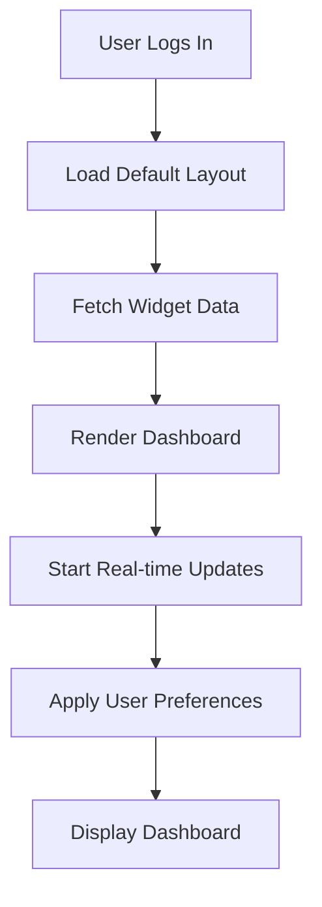
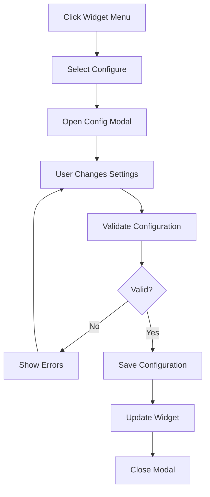

# Dashboards Feature Specification

**Version:** v1.1.0  
**Last Updated:** 2025-02-19  
**Author:** Product Team  
**Review Status:** Approved

## Overview

The dashboard system provides role-based interfaces tailored to the specific needs of administrators, coaches, and athletes. Each dashboard offers relevant information, quick actions, and insights to optimize user experience and productivity.

## User Stories

### As an admin...
- I want to see system statistics so I can monitor platform health
- I want to manage all users so I can maintain the system
- I want to view contact submissions so I can respond to inquiries
- I want to monitor API usage so I can optimize performance
- I want to download a database backup so I can safeguard data

### As a coach...
- I want to see my athlete roster so I can manage my clients
- I want quick access to recent shares so I can track activities
- I want to view workout statistics so I can analyze performance
- I want to share workouts quickly so I can save time
- I want to see a hint when sharing is disabled so I know what to do

### As an athlete...
- I want to see my shared workouts so I can stay updated
- I want to view my progress so I can track improvements
- I want to import workouts easily so I can follow my plan
- I want to communicate with my coach so I can get guidance
- I want to see a hint when importing is disabled so I know what to do
- I want to delete pending workouts with a warning so I don't lose data accidentally
- I want to pay my coach via Venmo so payment is easy

## Feature Requirements

### DB-001: Admin Dashboard

**Description**: Comprehensive administrative interface

**Requirements**:
- Statistics cards:
  - Total users by role
  - New registrations this month
  - Active sessions
  - System health status
- Quick actions:
  - Create new user
  - View recent activity
  - System maintenance
  - Generate reports
  - Download database backup (JSON export)
- User management widget:
  - Recent user signups
  - Users needing attention
  - Quick search
  - Bulk operations
- System monitoring:
  - API usage metrics
  - Error rates
  - Database performance
  - Storage usage
- Contact management:
  - Recent submissions
  - Response status
  - Quick reply
  - Assignment tracking

**Acceptance Criteria**:
- All statistics update in real-time
- Quick actions are one-click where possible
- Widgets can be rearr layout
- Data exports work correctly
- Mobile responsive design

### DB-002: Coach Dashboard

**Description**: Coach's central workspace

**Requirements**:
- Athlete overview:
  - Active athletes count
  - Recent athlete activities
  - Athletes needing attention
  - Quick athlete search
- Workout management:
  - Recent workout shares
  - Popular workouts
  - Pending imports
  - Sync status
- Quick share panel:
  - Select recent workouts
  - Choose athletes
  - Add message
  - One-click share
- Performance insights:
  - Share success rate
  - Athlete engagement
  - Popular workout types
  - Activity timeline
- Notifications:
  - New athlete signups
  - Import completions
  - Sync issues
  - Messages from athletes

**Acceptance Criteria**:
- Dashboard loads in < 2 seconds
- Real-time updates for activities
- Quick share requires minimal clicks
- Insights are actionable
- Notifications are timely

### DB-003: Athlete Dashboard

**Description**: Athlete's personal training hub

**Requirements**:
- Workout overview:
  - New shared workouts
  - Recently imported
  - Upcoming workouts
  - Completion rate
- Progress tracking:
  - Workout history chart
  - Performance metrics
  - Achievement badges
  - Personal records
- Quick actions:
  - Import all new workouts
  - View workout details
  - Message coach
  - Update profile
- Coach information:
  - Coach profile picture
  - Contact information
  - Recent messages
  - Office hours
- Motivational elements:
  - Inspirational quotes
  - Progress milestones
  - Streak counters
  - Upcoming events

**Acceptance Criteria**:
- New workouts are highlighted
- Progress is visually clearly
- Quick actions are accessible
- Coach info is accurate
- Mobile experience is excellent

### DB-004: Dashboard Customization

**Description**: Personalizable dashboard layouts

**Requirements**:
- Widget management:
  - Add/remove widgets
  - Deal widget position
  - Deal widget size
  - Create widget layouts
- Widget options:
  - Configure data ranges
  - Select display types
  - Set refresh intervals
  - Choose color themes
- Saved layouts:
  - Multiple layout presets
  - Switch between layouts
  - Share layouts (admin)
  - Reset to default
- Responsive behavior:
  - Mobile widget stacking
  - Tablet adjustments
  - Desktop full layout
  - Print-friendly layout

**Acceptance Criteria**:
- Widgets deal smoothly
- Layouts save correctly
- Mobile adaptation works
- Performance remains good
- No layout breaking

### DB-005: Data Visualization

**Description**: Charts and graphs for insights

**Requirements**:
- Chart types:
  - Line charts for trends
  - Bar charts for comparisons
  - Pie charts for distributions
  - Heat maps for patterns
- Interactive features:
  - Zoom and pan
  - Tooltips with details
  - Drill-down capability
  - Export options
- Real-time updates:
  - Live data streaming
  - Animated transitions
  - Auto-refresh options
  - Notification of changes
- Accessibility:
  - Screen reader support
  - Keyboard navigation
  - High contrast mode
  - Data table alternatives

**Acceptance Criteria**:
- Charts load quickly
- Interactions are smooth
- Data is accurate
- Export formats work
- Accessibility is maintained

### DB-006: Quick Actions Panel

**Description**: Frequently used actions at your fingertips

**Requirements**:
- Role-specific actions:
  - Admin: Create user, System check
  - Coach: Share workout, Message athlete
  - Athlete: Import workout, View progress
- Action shortcuts:
  - Keyboard shortcuts
  - Right-click menus
  - Drag-and-drop support
  - Voice commands (future)
- Recent actions:
  - Action history
  - Repeat action
  - Undo last action
  - Bulk repeat
- Smart suggestions:
  - Contextual actions
  - Predictive actions
  - Time-based suggestions
  - Learning preferences

**Acceptance Criteria**:
- Actions execute quickly
- Shortcuts are intuitive
- History is accurate
- Suggestions are relevant
- Performance is fast

### DB-007: Notification Center

**Description**: Centralized notification management

**Requirements**:
- Notification types:
  - Information messages
  - Success confirmations
  - Warning alerts
  - Error notifications
- Display options:
  - Toast notifications
  - Badge indicators
  - Notification list
  - Email summaries
- Management features:
  - Mark as read/unread
  - Delete notifications
  - Filter by type
  - Search notifications
- Preferences:
  - Notification settings
  - Do not disturb
  - Quiet hours
  - Priority levels

**Acceptance Criteria**:
- Notifications appear promptly
- Types are visually distinctly
- Management is easy
- Preferences are saved
- Performance is good

### DB-008: Search and Filter

**Description**: Powerful search across dashboard data

**Requirements**:
- Global search:
  - Search all data types
  - Quick suggestions
  - Recent searches
  - Advanced syntax
- Filter options:
  - Date ranges
  - Categories
  - Status filters
  - Custom filters
- Saved searches:
  - Save frequent searches
  - Share saved searches
  - Auto-refresh saved
  - Search alerts
- Results display:
  - Relevant ranking
  - Highlight matches
  - Group by type
  - Export results

**Acceptance Criteria**:
- Search is fast
- Results are relevant
- Filters work correctly
- Saves persist
- Export works

## Technical Specifications

### Dashboard Architecture

```typescript
// Dashboard Layout System
interface DashboardLayout {
  id: string;
  name: string;
  role: UserRole;
  widgets: WidgetConfig[];
  grid: GridConfig;
  theme: ThemeConfig;
}

interface WidgetConfig {
  id: string;
  type: WidgetType;
  position: Position;
  size: Size;
  config: WidgetDataConfig;
  refreshInterval: number;
}

// Widget Types
type WidgetType = 
  | 'statistics'
  | 'chart'
  | 'list'
  | 'table'
  | 'quick-actions'
  | 'notifications'
  | 'calendar'
  | 'progress';
```

### Component Structure

```typescript
// Base Widget Component
interface BaseWidgetProps {
  widget: WidgetConfig;
  data: any;
  loading: boolean;
  error?: string;
  onConfigChange: (config: any) => void;
  onResize: (size: Size) => void;
  onMove: (position: Position) => void;
}

// Dashboard Container
interface DashboardProps {
  layout: DashboardLayout;
  widgets: Record<string, WidgetData>;
  onLayoutChange: (layout: DashboardLayout) => void;
  onAction: (action: DashboardAction) => void;
}
```

### Data Fetching Strategy

```typescript
// React Query for Dashboard Data
const useDashboardData = (role: UserRole) => {
  return useQuery({
    queryKey: ['dashboard', role],
    queryFn: () => fetchDashboardData(role),
    refetchInterval: 30000, // 30 seconds
    staleTime: 10000,
  });
};

// Widget-specific data hooks
const useWidgetData = (widgetId: string, config: WidgetConfig) => {
  return useQuery({
    queryKey: ['widget', widgetId, config],
    queryFn: () => fetchWidgetData(widgetId, config),
    refetchInterval: config.refreshInterval,
  });
};
```

### API Endpoints

```yaml
GET /api/v1/dashboard/{role}
  auth: required
  response:
    layout: DashboardLayout
    widgets: Record<string, any>
    permissions: string[]

PUT /api/v1/dashboard/layout
  auth: required
  request:
    layout: DashboardLayout
  response:
    success: boolean

GET //api/v1/dashboard/widgets/{type}
  auth: required
  query:
    config: object
  response:
    data: any
    metadata: object

POST /api/v1/dashboard/actions
  auth: required
  request:
    action: string
    data: any
  response:
    result: any
    message: string
```

### Database Schema

```sql
-- Dashboard layouts
CREATE TABLE dashboard_layouts (
    id UUID PRIMARY KEY DEFAULT gen_random_uuid(),
    user_id UUID REFERENCES users(id),
    role VARCHAR(50) NOT NULL,
    name VARCHAR(255) NOT NULL,
    layout_config JSONB NOT NULL,
    is_default BOOLEAN DEFAULT FALSE,
    created_at TIMESTAMP DEFAULT NOW(),
    updated_at TIMESTAMP DEFAULT NOW()
);

-- Widget configurations
CREATE TABLE widget_configs (
    id UUID PRIMARY KEY DEFAULT gen_random_uuid(),
    user_id UUID REFERENCES users(id),
    widget_id VARCHAR(255) NOT NULL,
    widget_type VARCHAR(50) NOT NULL,
    config JSONB NOT NULL,
    position JSONB NOT NULL,
    size JSONB NOT NULL,
    created_at TIMESTAMP DEFAULT NOW(),
    updated_at TIMESTAMP DEFAULT NOW()
);

-- Dashboard activity logs
CREATE TABLE dashboard_activities (
    id UUID PRIMARY KEY DEFAULT gen_random_uuid(),
    user_id UUID REFERENCES users(id),
    action VARCHAR(100) NOT NULL,
    details JSONB,
    created_at TIMESTAMP DEFAULT NOW()
);

-- Indexes
CREATE INDEX idx_dashboard_layouts_user_role ON dashboard_layouts(user_id, role);
CREATE INDEX idx_widget_configs_user_type ON widget_configs(user_id, widget_type);
```

## Design Specifications

### Layout Grid System

```css
/* CSS Grid for Dashboard */
.dashboard-grid {
  display: grid;
  grid-template-columns: repeat(12, 1fr);
  grid-auto-rows: 80px;
  gap: 16px;
  padding: 24px;
}

.widget {
  background: white;
  border-radius: 8px;
  box-shadow: 0 1px 3px rgba(0,0,0,0.1);
  padding: 16px;
  transition: all 0.3s ease;
}

.widget:hover {
  box-shadow: 0 4px 6px rgba(0,0,0,0.1);
}

/* Responsive adjustments */
@media (max-width: 768px) {
  .dashboard-grid {
    grid-template-columns: 1fr;
    gap: 8px;
    padding: 8px;
  }
}
```

### Widget Design Patterns

```typescript
// Statistics Widget
const StatisticsWidget = ({ data, config }) => {
  return (
    <div className="statistics-widget">
      <div className="stats-grid">
        {data.stats.map(stat => (
          <div key={stat.key} className="stat-card">
            <div className="stat-value">{stat.value}</div>
            <div className="stat-label">{stat.label}</div>
            <div className="stat-change">{stat.change}</div>
          </div>
        ))}
      </div>
    </div>
  );
};

// Chart Widget
const ChartWidget = ({ data, config }) => {
  return (
    <div className="chart-widget">
      <h3>{config.title}</h3>
      <ResponsiveContainer width="100%" height={300}>
        <LineChart data={data}>
          <XAxis dataKey="date" />
          <YAxis />
          <Tooltip />
          <Line type="monotone" dataKey="value" stroke="#3b82f6" />
        </LineChart>
      </ResponsiveContainer>
    </div>
  );
};
```

## Performance Optimizations

### Lazy Loading

```typescript
// Lazy widget loading
const LazyWidget = React.lazy(() => import('./Widget'));

const DashboardGrid = ({ widgets }) => {
  return (
    <div className="dashboard-grid">
      {widgets.map(widget => (
        <Suspense key={widget.id} fallback={<WidgetSkeleton />}>
          <LazyWidget widget={widget} />
        </Suspense>
      ))}
    </div>
  );
};
```

### Data Caching

```typescript
// SWR for data caching
const useDashboardCache = (key: string, fetcher: Function) => {
  return useSWR(key, fetcher, {
    revalidateOnFocus: false,
    revalidateOnReconnect: true,
    refreshInterval: 30000,
    dedupingInterval: 10000,
  });
};
```

### Virtual Scrolling

```typescript
// For large lists in widgets
import { FixedSizeList as List } from 'react-window';

const VirtualizedList = ({ items }) => {
  const Row = ({ index, style }) => (
    <div style={style}>
      <ListItem item={items[index]} />
    </div>
  );

  return (
    <List
      height={400}
      itemCount={items.length}
      itemSize={60}
    >
      {Row}
    </List>
  );
};
```

## User Experience Flows

### Dashboard Initialization



### Widget Configuration



## Testing Requirements

### Unit Tests

- Widget rendering
- Data transformation
- Configuration validation
- Event handling

### Integration Tests

- Dashboard loading
- Widget communication
- Data fetching
- Real-time updates

### E2E Tests

- Complete dashboard workflows
- Widget customization
- Role-based access
- Mobile responsiveness

## Accessibility Requirements

### WCAG 2.1 AA Compliance

- Keyboard navigation for all widgets
- ARIA labels and descriptions
- Focus management
- Color contrast compliance
- Screen reader support

### Accessibility Features

```typescript
// Accessible Widget Wrapper
const AccessibleWidget = ({ title, children, ...props }) => {
  return (
    <section
      aria-label={title}
      role="region"
      tabIndex={0}
      {...props}
    >
      <h2 id={`widget-${props.id}-title`}>{title}</h2>
      <div aria-describedby={`widget-${props.id}-title`}>
        {children}
      </div>
    </section>
  );
};
```

## Monitoring and Analytics

### Dashboard Metrics

- Load time per dashboard
- Widget interaction rates
- Feature usage statistics
- Error rates by widget
- User satisfaction scores

### Performance Monitoring

```typescript
// Performance tracking
const trackDashboardPerformance = () => {
  const observer = new PerformanceObserver((list) => {
    list.getEntries().forEach((entry) => {
      if (entry.name.includes('dashboard')) {
        analytics.track('dashboard_performance', {
          name: entry.name,
          duration: entry.duration,
          timestamp: entry.startTime,
        });
      }
    });
  });
  
  observer.observe({ entryTypes: ['measure'] });
};
```

## Future Enhancements

### Phase 2 Features

- AI-powered insights
- Predictive analytics
- Advanced visualizations
- Collaborative dashboards
- Custom widget builder

### Phase 3 Features

- Voice commands
- Gesture controls
- Augmented reality views
- Integration with external tools
- Advanced automation
