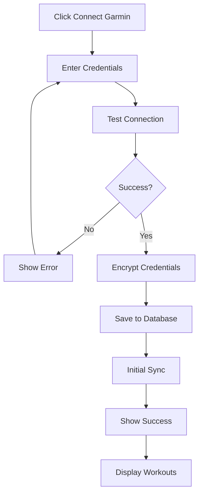
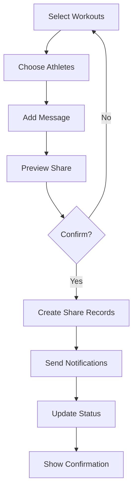

# Garmin Integration Feature Specification

**Version:** v1.0.0  
**Last Updated:** 2025-02-17  
**Author:** Product Team  
**Review Status:** Approved

## Overview

The Garmin Connect integration enables seamless workout sharing between coaches and athletes through the Garmin Connect platform. This feature is the core value proposition of the Transformation Coaching platform.

## User Stories

### As a coach...
- I want to connect my Garmin account so I can access my workouts
- I want to sync my workouts automatically so they're always available
- I want to select specific workouts to share so I can create programs
- I want to share workouts with multiple athletes so I can save time
- I want to track which athletes imported workouts so I can follow up

### As an athlete...
- I want to connect my Garmin account so I can receive workouts
- I want to import shared workouts directly to my device so it's easy
- I want to see workout details before importing so I know what to expect
- I want to track my imported workouts so I can monitor progress
- I want to get notifications when new workouts are shared so I don't miss them

## Feature Requirements

### GI-001: Garmin Account Connection

**Description**: Securely connect Garmin Connect accounts

**Requirements**:
- Connection form with:
  - Garmin email/username
  - Garmin password
  - "Show password" toggle
  - Connection test button
- Security measures:
  - AES-256 encryption for credentials
  - Secure credential storage
  - Two-factor authentication support
- Connection status:
  - Connected indicator with last sync time
  - Connection health monitoring
  - Automatic reconnection on failure
- Multi-account support (future)

**Acceptance Criteria**:
- Credentials are encrypted before storage
- Connection test validates credentials
- 2FA works correctly
- Status updates in real-time
- Connection can be disconnected anytime

### GI-002: Workout Synchronization

**Description**: Fetch workouts from Garmin Connect

**Requirements**:
- Sync options:
  - Automatic daily sync
  - Manual sync on demand
  - Date range selection
- Sync process:
  - Incremental sync (new/modified only)
  - Progress indicator
  - Error handling with retry
  - Sync history and logs
- Workout types supported:
  - Running
  - Cycling
  - Swimming
  - Strength training
  - Triathlon
  - Other custom workouts
- Rate limiting compliance:
  - Respect Garmin API limits
  - Queue management
  - Backoff on errors

**Acceptance Criteria**:
- Sync completes within 30 seconds
- Only new workouts are fetched
- Errors are clearly communicated
- History shows all sync attempts
- Rate limits are never exceeded of

### GI-003: Workout Library

**Description**: Display and manage synced workouts

**Requirements**:
- Workout list with:
  - Thumbnail/calendar view
  - List view with details
  - Search by name/type
  - Filter by date, type, distance
  - Sort by date, name, duration
- Workout details:
  - Name and description
  - Date and duration
  - Distance and pace
  - Heart rate zones
  - Workout steps/intervals
  - Equipment used
- Workout actions:
  - Preview workout structure
  - Edit workout details (local copy)
  - Add to favorites
  - Share with athletes

**Acceptance Criteria**:
- All workout types display correctly
- Search returns relevant results
- Filters can be combined
- Workout preview is accurate
- Actions are intuitive

### GI-004: Workout Sharing

**Description**: Share workouts with athletes

**Requirements**:
- Share workflow:
  - Select workouts (multi-select)
  - Select athletes (multi-select)
  - Add optional message/instructions
  - Set expiration date (optional)
  - Preview before sharing
- Sharing options:
  - Share individual workouts
  - Share workout collections/programs
  - Share with all athletes
  - Schedule future sharing
- Share management:
  - View shared workouts status
  - Revoke shared workouts
  - Resend notifications
  - Duplicate sharing

**Acceptance Criteria**:
- Bulk sharing works efficiently
- Athletes receive notifications
- Status updates in real-time
- Revocation works immediately
- History is maintained

### GI-005: Workout Import

**Description**: Athletes import shared workouts

**Requirements**:
- Import interface:
  - List of shared workouts
  - Workout preview/details
  - Import status indicators
  - Batch import option
- Import process:
  - One-click import to Garmin
  - Progress tracking
  - Success/failure notifications
  - Error resolution guidance
- Import options:
  - Import to specific date
  - Import as template
  - Modify before import
  - Import to calendar

**Acceptance Criteria**:
- Import completes successfully
- Status is accurately tracked
- Errors have clear solutions
- Batch import works
- Workout appears in Garmin

### GI-006: Workout Analytics

**Description**: Track workout sharing and performance

**Requirements**:
- Coach analytics:
  - Most shared workouts
  - Athlete import rates
  - Popular workout types
  - Sharing trends over time
- Athlete analytics:
  - Imported workouts history
  - Workout completion rates
  - Performance improvements
  - Progress charts
- Admin analytics:
  - Platform-wide sharing stats
  - Garmin sync success rates
  - User engagement metrics
  - Feature adoption rates

**Acceptance Criteria**:
- Analytics update in real-time
- Charts are interactive
- Data can be exported
- Filters work correctly
- Performance is acceptable

### GI-007: Notification System

**Description**: Alert users of workout activities

**Requirements**:
- Notification types:
  - New workout shared
  - Workout imported successfully
  - Workout import failed
  - Garmin connection issues
- Delivery channels:
  - In-app notifications
  - Email notifications
  - Push notifications (future)
- Notification preferences:
  - Enable/disable per type
  - Frequency controls
  - Quiet hours
  - Do not disturb

**Acceptance Criteria**:
- Notifications are timely
- Preferences are respected
- History is maintained
- Performance is good
- Reliability is high

## Technical Specifications

### Garmin API Integration

```python
# Garmin Service Implementation
class GarminService:
    def __init__(self, encrypted_credentials: str):
        self.credentials = self.decrypt_credentials(encrypted_credentials)
        self.client = GarminConnect(
            self.credentials['email'],
            self.credentials['password']
        )
    
    async def sync_workouts(self, start_date: date, end_date: date):
        """Sync workouts for date range"""
        try:
            await self.client.login()
            workouts = await self.client.get_workouts(start_date, end_date)
            return self.transform_workouts(workouts)
        except GarminConnectException as e:
            self.handle_sync_error(e)
            raise
    
    async def share_workout(self, workout_id: str, athlete: Athlete):
        """Share workout with athlete"""
        workout = await self.client.get_workout(workout_id)
        shared_workout = self.prepare_shared_workout(workout)
        await self.send_to_athlete(athlete, shared_workout)
    
    async def import_workout(self, shared_workout: SharedWorkout):
        """Import workout to athlete's Garmin"""
        workout_data = self.convert_to_garmin_format(shared_workout)
        await self.client.upload_workout(workout_data)
```

### Data Models

```python
# Workout Data Structure
class Workout(BaseModel):
    id: str
    name: str
    description: Optional[str]
    sport_type: SportType
    start_time: datetime
    duration: timedelta
    distance: Optional[float]
    avg_hr: Optional[int]
    max_hr: Optional[int]
    steps: List[WorkoutStep]
    equipment: List[str]
    created_at: datetime
    updated_at: datetime

class WorkoutStep(BaseModel):
    type: StepType
    duration: Optional[timedelta]
    distance: Optional[float]
    target_hr_zone: Optional[int]
    power: Optional[float]
    description: str

class SharedWorkout(BaseModel):
    id: UUID
    original_workout_id: str
    coach_id: UUID
    athlete_id: UUID
    workout_data: Workout
    shared_at: datetime
    expires_at: Optional[datetime]
    status: ShareStatus
    import_attempts: int
    last_import_attempt: Optional[datetime]
```

### API Endpoints

```yaml
POST /api/v1/garmin/connect
  auth: required
  request:
    email: string
    password: string
  response:
    status: "connected" | "error"
    message: string

GET /api/v1/garmin/status
  auth: required
  response:
    connected: boolean
    last_sync: datetime
    sync_status: string
    total_workouts: number

POST /api/v1/garmin/sync
  auth: required
  request:
    start_date: date
    end_date: date
    force: boolean
  response:
    synced_count: number
    errors: string[]

GET /api/v1/coach/workouts
  auth: coach
  query:
    start_date: date
    end_date: date
    sport_type: string
    search: string
  response:
    workouts: Workout[]
    total: number

POST /api/v1/coach/workouts/share
  auth: coach
  request:
    workout_ids: string[]
    athlete_ids: UUID[]
    message: string
    expires_at?: datetime
  response:
    shared_workouts: SharedWorkout[]

GET /api/v1/athlete/workouts
  auth: athlete
  query:
    status: string
    date_range: string
  response:
    shared_workouts: SharedWorkout[]

POST /api/v1/athlete/workouts/{id}/import
  auth: athlete
  request:
    target_date?: date
    modify: boolean
  response:
    status: "imported" | "failed"
    message: string
    garmin_workout_id?: string
```

### Database Schema

```sql
-- Garmin credentials (encrypted)
CREATE TABLE garmin_credentials (
    id UUID PRIMARY KEY DEFAULT gen_random_uuid(),
    user_id UUID REFERENCES users(id) UNIQUE,
    encrypted_email TEXT NOT NULL,
    encrypted_password TEXT NOT NULL,
    last_sync TIMESTAMP,
    sync_status VARCHAR(50) DEFAULT 'pending',
    error_count INTEGER DEFAULT 0,
    created_at TIMESTAMP DEFAULT NOW(),
    updated_at TIMESTAMP DEFAULT NOW()
);

-- Workouts (synced from)
CREATE TABLE workouts (
    id UUID PRIMARY KEY DEFAULT gen_random_uuid(),
    user_id UUID REFERENCES users(id),
    garmin_workout_id VARCHAR(255) NOT NULL,
    name VARCHAR(255) NOT NULL,
    description TEXT,
    sport_type VARCHAR(50) NOT NULL,
    start_time TIMESTAMP NOT NULL,
    duration INTERVAL NOT NULL,
    distance DECIMAL(10,2),
    avg_heart_rate INTEGER,
    max_heart_rate INTEGER,
    workout_data JSONB NOT NULL,
    created_at TIMESTAMP DEFAULT NOW(),
    updated_at TIMESTAMP DEFAULT NOW(),
    UNIQUE(user_id, garmin_workout_id)
);

-- Shared workouts
CREATE TABLE shared_workouts (
    id UUID PRIMARY KEY DEFAULT gen_random_uuid(),
    workout_id UUID REFERENCES workouts(id),
    coach_id UUID REFERENCES users(id),
    athlete_id UUID REFERENCES users(id),
    message TEXT,
    expires_at TIMESTAMP,
    status VARCHAR(50) DEFAULT 'pending',
    import_attempts INTEGER DEFAULT 0,
    last_import_attempt TIMESTAMP,
    garmin_workout_id VARCHAR(255),
    imported_at TIMESTAMP,
    created_at TIMESTAMP DEFAULT NOW(),
    updated_at TIMESTAMP DEFAULT NOW()
);

-- Sync logs
CREATE TABLE sync_logs (
    id UUID PRIMARY KEY DEFAULT gen_random_uuid(),
    user_id UUID REFERENCES users(id),
    sync_type VARCHAR(50) NOT NULL,
    status VARCHAR(50) NOT NULL,
    items_synced INTEGER DEFAULT 0,
    error_message TEXT,
    duration_ms INTEGER,
    created_at TIMESTAMP DEFAULT NOW()
);

-- Indexes
CREATE INDEX idx_workouts_user_date ON workouts(user_id, start_time DESC);
CREATE INDEX idx_shared_workouts_athlete ON shared_workouts(athlete_id, created_at DESC);
CREATE INDEX idx_shared_workouts_coach ON shared_workouts(coach_id, created_at DESC);
CREATE INDEX idx_sync_logs_user_created ON sync_logs(user_id, created_at DESC);
```

### Frontend Components

```typescript
// Connection Status Component
interface GarminConnectionProps {
  isConnected: boolean;
  lastSync?: Date;
  onConnect: () => void;
  onDisconnect: () => void;
  onSync: () => void;
}

// Workout List Component
interface WorkoutListProps {
  workouts: Workout[];
  loading: boolean;
  selectedWorkouts: string[];
  onSelect: (ids: string[]) => void;
  onShare: (workoutIds: string[]) => void;
}

// Workout Share Dialog
interface ShareDialogProps {
  workouts: Workout[];
  athletes: Athlete[];
  onShare: (request: ShareRequest) => void;
  onCancel: () => void;
}

// Import Status Component
interface ImportStatusProps {
  sharedWorkouts: SharedWorkout[];
  onImport: (id: string) => void;
  onViewDetails: (id: string) => void;
}
```

## Security Considerations

### Credential Management

```python
# Encryption Service
class CredentialEncryption:
    def __init__(self, key: bytes):
        self.cipher = Fernet(key)
    
    def encrypt_credentials(self, email: str, password: str) -> dict:
        encrypted_email = self.cipher.encrypt(email.encode()).decode()
        encrypted_password = self.cipher.encrypt(password.encode()).decode()
        return {
            'email': encrypted_email,
            'password': encrypted_password
        }
    
    def decrypt_credentials(self, encrypted: dict) -> dict:
        email = self.cipher.decrypt(encrypted['email'].encode()).decode()
        password = self.cipher.decrypt(encrypted['password'].encode()).decode()
        return {'email': email, 'password': password}
```

### API Security

- Rate limiting per user
- Request validation
- Error sanitization
- Audit logging
- Token rotation

## User Experience Flows

### Coach Connection Flow



### Workout Sharing Flow



## Error Handling

### Common Scenarios

1. **Invalid Credentials**
   - Clear error message
   - Credential correction prompt
   - Account lockout warning

2. **Sync Failures**
   - Retry mechanism
   - Partial success handling
   - Manual retry option

3. **Import Failures**
   - Specific error messages
   - Resolution steps
   - Alternative options

4. **Rate Limits**
   - Queue management
   - Progress indication
   - Estimated completion time

## Testing Requirements

### Unit Tests

- Credential encryption/decryption
- Workout data transformation
- Sync logic
- Share status updates

### Integration Tests

- Garmin API integration
- End-to-end sync process
- Share and import workflow
- Error scenarios

### E2E Tests

- Complete coach workflow
- Complete athlete workflow
- Connection management
- Bulk operations

## Performance Requirements

| Operation | Target | Measurement |
|-----------|--------|-------------|
| Initial sync | < 2 minutes | 100 workouts |
| Incremental sync | < 30 seconds | 10 workouts |
| Workout share | < 5 seconds | 10 workouts |
| Workout import | < 10 seconds | 1 workout |

## Monitoring

### Key Metrics

- Sync success rate
- Import success rate
- API response times
- Error rates by type
- User engagement

### Alerts

- Sync failures
- Import failures
- API rate limits
- Connection issues

## Compliance

### Garmin ToS Compliance

- No data redistribution
- User consent required
- Proper attribution
- Rate limit respect
- No competitive features

### Data Privacy

- Encrypted storage
- User control
- Data deletion
- Audit trail
- Consent management

## Future Enhancements

### Phase 2

- Real-time sync
- Workout customization
- Advanced analytics
- Mobile app
- Calendar integration

### Phase 3

- AI workout recommendations
- Performance predictions
- Social features
- Challenges/competitions
- Integration with other platforms
