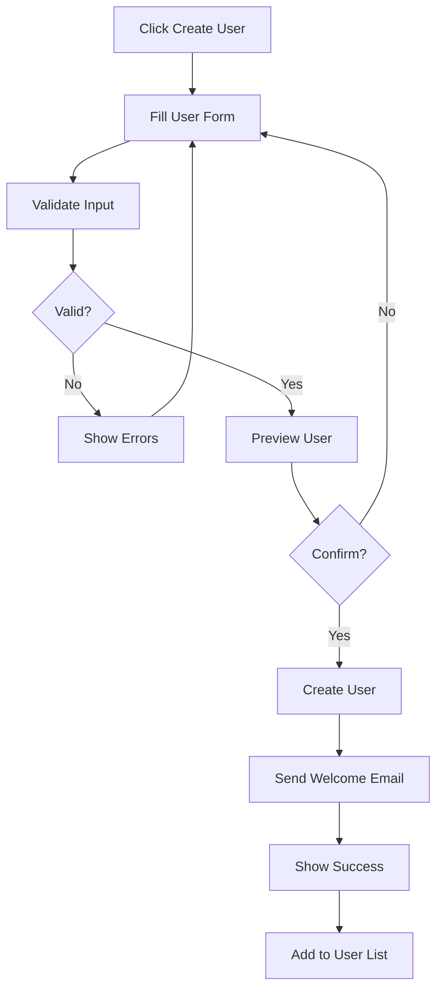
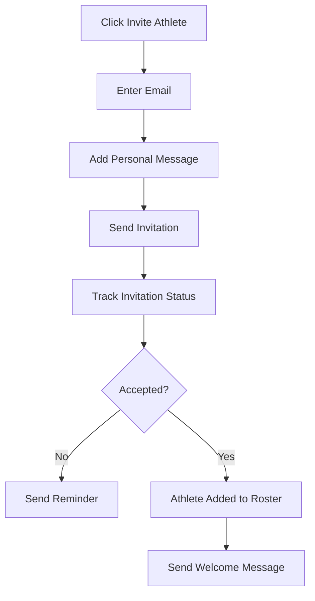

# User Management Feature Specification

**Version:** v1.0.0  
**Last Updated:** 2025-02-17  
**Author:** Product Team  
**Review Status:** Approved

## Overview

The user management system provides comprehensive control over user accounts, roles, and permissions. It enables administrators to manage the entire user lifecycle while providing coaches with tools to manage their athletes.

## User Stories

### As an admin...
- I want to view all users so I can monitor system usage
- I want to create coach accounts so I can onboard new coaches
- I want to edit user information so I can keep records accurate
- I want to deactivate users so I can maintain security
- I want to view user statistics so I can make informed decisions

### As a coach...
- I want to see my athletes so I can manage their training
- I want to invite athletes so I can expand my client base
- I want to view athlete progress so I can adjust programs
- I want to remove athletes so I can manage my roster

### As an athlete...
- I want to view my profile so I can keep it updated
- I want to select a coach so I can start training
- I want to view my progress so I can track improvements

## Feature Requirements

### UM-001: Admin Dashboard - User Overview

**Description**: Central hub for user management

**Requirements**:
- User statistics cards:
  - Total users
  - Active users (last 30 days)
  - New users this month
  - Users by role
- User list with:
  - Search by name/email
  - Filter by role, status, registration date
  - Sort by various columns
  - Pagination (20 users per page)
- Quick actions:
  - Create new user
  - Bulk operations
  - Export user list
- Real-time updates via WebSocket (future)

**Acceptance Criteria**:
- Statistics update in real-time
- Search returns results in < 500ms
- Filters can be combined
- Export supports CSV and PDF formats
- Mobile-responsive table design

### UM-002: User Creation

**Description**: Create new user accounts

**Requirements**:
- Create user form with:
  - Email address (required)
  - Full name (required)
  - Role selection (required)
  - Generate temporary password option
  - Send welcome email option
- Coach-specific fields:
  - Bio/description
  - Certifications
  - Specializations
  - Hourly rate (optional)
- Athlete-specific fields:
  - Date of birth
  - Emergency contact
  - Medical conditions (private)
- Validation rules:
  - Unique email address
  - Valid email format
  - Required field validation

**Acceptance Criteria**:
- Form validates all inputs
- Temporary password meets security requirements
- Welcome email is sent correctly
- User appears in list immediately
- Coach gets initial access to coach dashboard

### UM-003: User Profile Management

**Description**: Edit user information and settings

**Requirements**:
- Profile sections:
  - Basic information (name, email, avatar)
  - Contact information
  - Role-specific details
  - Account settings
- Avatar upload:
  - Image preview
  - Crop functionality
  - File size limit (5MB)
  - Format validation (JPG, PNG, WebP)
- Email change process:
  - Current password required
  - Verification email sent
  - Old email remains until verified
- Password management:
  - Change password
  - Force password reset
  - View last password change

**Acceptance Criteria**:
- Avatar uploads work correctly
- Email changes require verification
- Password changes are secure
- All fields validate properly
- Changes save immediately

### UM-004: Role and Permission Management

**Description**: Manage user roles and access rights

**Requirements**:
- Role definitions:
  - **Admin**: Full system access
  - **Coach**: Manage athletes, share workouts
  - **Athlete**: View/import workouts
- Permission matrix:
  - User management (admin only)
  - Workout sharing (coach)
  - Dashboard access (all)
  - Settings access (all)
- Role change workflow:
  - Admin can change any role
  - Role change requires confirmation
  - Email notification of role change
  - Session refresh on role change

**Acceptance Criteria**:
- Role changes take effect immediately
- Permissions enforce correctly
- Users cannot elevate their own role
- Email notifications are sent
- Audit trail is maintained

### UM-005: Athlete Management for Coaches

**Description**: Coach tools for managing their athletes

**Requirements**:
- Athlete roster:
  - List of assigned athletes
  - Athlete status (active/inactive)
  - Last login date
  - Garmin connection status
- Invite athletes:
  - Email invitation with link
  - Custom message
  - Invitation tracking
  - Revoke pending invitations
- Athlete profile view:
  - Basic information
  - Training history
  - Progress metrics
  - Notes section (private)
- Bulk actions:
  - Share workout with multiple athletes
  - Send message to all athletes
  - Export athlete data

**Acceptance Criteria**:
- Invitations expire after 7 days
- Coach can only see their athletes
- Notes are private to coach
- Bulk actions work efficiently
- Search filters athletes correctly

### UM-006: User Status Management

**Description**: Control user account status

**Requirements**:
- Status types:
  - Active: Full access
  - Inactive: Cannot log in
  - Suspended: Temporary lock
  - Pending: Email not verified
- Status change actions:
  - Deactivation (grace period)
  - Suspension with reason
  - Reactivation
  - Forced deletion (admin only)
- Automated status changes:
  - Inactive after 90 days no login
  - Unverified after 7 days
  - Suspended after policy violation

**Acceptance Criteria**:
- Status changes take effect immediately
- Users are notified of status changes
- Grace periods work correctly
- Automated rules run daily
- Audit trail tracks all changes

### UM-007: User Search and Filtering

**Description**: Advanced user discovery capabilities

**Requirements**:
- Search options:
  - Name (partial match)
  - Email (exact match)
  - Role
  - Status
  - Registration date range
  - Last login date range
- Saved searches:
  - Save frequently used filters
  - Quick access to saved searches
  - Share saved searches with admins
- Advanced filters:
  - Athletes without coach
  - Coaches with < 5 athletes
  - Users with Garmin connected
  - Users by country/region

**Acceptance Criteria**:
- Search returns relevant results
- Filters can be combined
- Saved searches persist
- Performance remains fast with many users
- Export filtered search results

### UM-008: User Activity Tracking

**Description**: Monitor user actions and engagement

**Requirements**:
- Activity log includes:
  - Login/logout events
  - Profile changes
  - Workout sharing
  - Garmin connections
  - Password changes
- Activity views:
  - Timeline view per user
  - Summary statistics
  - Filter by action type
  - Export activity logs
- Engagement metrics:
  - Login frequency
  - Feature usage
  - Time on platform
  - Last activity date

**Acceptance Criteria**:
- All activities are logged
- Timeline is chronological
- Filters work correctly
- Data exports include all fields
- Performance with large datasets

### UM-009: Bulk User Operations

**Description**: Efficiently manage multiple users

**Requirements**:
- Bulk operations:
  - Create multiple users
  - Update user roles
  - Deactivate users
  - Send notifications
  - Export data
- Import users:
  - CSV file upload
  - Template download
  - Validation preview
  - Error reporting
- Bulk communication:
  - Email all users
  - Email by role
  - Email by filter
  - Message templates

**Acceptance Criteria**:
- Bulk operations complete efficiently
- Import validates all data
- Error reports are clear
- Templates save correctly
- Operations can be cancelled

## Technical Specifications

### API Endpoints

```yaml
GET /api/v1/admin/users
  auth: admin
  query:
    page: number
    size: number
    search: string
    role: string
    status: string
  response:
    users: User[]
    total: number
    page: number

POST /api/v1/admin/users
  auth: admin
  request:
    email: string
    full_name: string
    role: string
    password?: string
    send_welcome: boolean
  response:
    user: User

PUT /api/v1/admin/users/{id}
  auth: admin
  request:
    email?: string
    full_name?: string
    role?: string
    status?: string
  response:
    user: User

DELETE /api/v1/admin/users/{id}
  auth: admin
  response:
    message: "User deactivated"

GET /api/v1/admin/users/{id}/activity
  auth: admin
  query:
    page: number
    action_type: string
  response:
    activities: Activity[]
    total: number

POST /api/v1/admin/users/bulk
  auth: admin
  request:
    action: string
    user_ids: uuid[]
    data: object
  response:
    success_count: number
    errors: Error[]

GET /api/v1/coach/athletes
  auth: coach
  query:
    status: string
    search: string
  response:
    athletes: User[]
    total: number

POST /api/v1/coach/athletes/invite
  auth: coach
  request:
    email: string
    message: string
  response:
    invitation: Invitation

GET /api/v1/athlete/coaches
  auth: athlete
  response:
    coaches: Coach[]
    available_spots: number

POST /api/v1/athlete/coach/{id}
  auth: athlete
  request:
    message: string
  response:
    connection: Connection
```

### Database Schema

```sql
-- Users table (extended from auth)
ALTER TABLE users ADD COLUMN IF NOT EXISTS
    bio TEXT,
    phone VARCHAR(50),
    date_of_birth DATE,
    emergency_contact_name VARCHAR(255),
    emergency_contact_phone VARCHAR(50),
    medical_conditions TEXT,
    certifications JSONB,
    specializations TEXT[],
    hourly_rate DECIMAL(10,2),
    timezone VARCHAR(50),
    language VARCHAR(10) DEFAULT 'en',
    avatar_updated_at TIMESTAMP;

-- User activities
CREATE TABLE user_activities (
    id UUID PRIMARY KEY DEFAULT gen_random_uuid(),
    user_id UUID REFERENCES users(id),
    action VARCHAR(100) NOT NULL,
    details JSONB,
    ip_address INET,
    user_agent TEXT,
    created_at TIMESTAMP DEFAULT NOW()
);

-- Coach-athlete relationships
CREATE TABLE coach_athlete_relations (
    id UUID PRIMARY KEY DEFAULT gen_random_uuid(),
    coach_id UUID REFERENCES users(id),
    athlete_id UUID REFERENCES users(id),
    status VARCHAR(20) DEFAULT 'active',
    created_at TIMESTAMP DEFAULT NOW(),
    updated_at TIMESTAMP DEFAULT NOW(),
    UNIQUE(coach_id, athlete_id)
);

-- Invitations
CREATE TABLE invitations (
    id UUID PRIMARY KEY DEFAULT gen_random_uuid(),
    email VARCHAR(255) NOT NULL,
    inviter_id UUID REFERENCES users(id),
    role VARCHAR(50) NOT NULL,
    token VARCHAR(255) UNIQUE NOT NULL,
    message TEXT,
    expires_at TIMESTAMP NOT NULL,
    accepted_at TIMESTAMP,
    created_at TIMESTAMP DEFAULT NOW()
);

-- User notes (coach private)
CREATE TABLE user_notes (
    id UUID PRIMARY KEY DEFAULT gen_random_uuid(),
    coach_id UUID REFERENCES users(id),
    athlete_id UUID REFERENCES users(id),
    note TEXT NOT NULL,
    created_at TIMESTAMP DEFAULT NOW(),
    updated_at TIMESTAMP DEFAULT NOW()
);

-- Indexes for performance
CREATE INDEX idx_user_activities_user_created ON user_activities(user_id, created_at DESC);
CREATE INDEX idx_coach_athlete_relations_coach ON coach_athlete_relations(coach_id);
CREATE INDEX idx_coach_athlete_relations_athlete ON coach_athlete_relations(athlete_id);
CREATE INDEX idx_invitations_email ON invitations(email);
```

### Frontend Components

```typescript
// User Management Table
interface UserTableProps {
  users: User[];
  loading: boolean;
  onUserSelect: (user: User) => void;
  onBulkAction: (action: string, users: User[]) => void;
}

// User Form
interface UserFormProps {
  user?: User;
  mode: 'create' | 'edit';
  onSave: (user: User) => void;
  onCancel: () => void;
}

// Athlete Card
interface AthleteCardProps {
  athlete: Athlete;
  onWorkoutShare: () => void;
  onViewProfile: () => void;
  onSendMessage: () => void;
}

// Activity Timeline
interface ActivityTimelineProps {
  userId: string;
  activities: Activity[];
  onLoadMore: () => void;
}
```

## Security Considerations

### Access Control

```python
# Permission decorators
def require_admin(func):
    def wrapper(*args, **kwargs):
        if not current_user.is_admin:
            raise PermissionError("Admin access required")
        return func(*args, **kwargs)
    return wrapper

def require_ownership_or_admin(model):
    def decorator(func):
        def wrapper(*args, **kwargs):
            resource = get_resource(model, kwargs['id'])
            if not (current_user.is_admin or resource.owner_id == current_user.id):
                raise PermissionError("Access denied")
            return func(*args, **kwargs)
        return wrapper
    return decorator
```

### Data Protection

- PII encryption at rest
- Audit logging for all changes
- Data minimization in displays
- Secure file handling for uploads
- Rate limiting on sensitive operations

## User Experience Flows

### Admin User Creation Flow



### Coach Athlete Invitation Flow



## Testing Requirements

### Unit Tests

- User creation validation
- Role permission checks
- Search functionality
- Activity logging

### Integration Tests

- Complete user lifecycle
- Bulk operations
- Import/export functionality
- Email notifications

### E2E Tests

- Admin user management workflow
- Coach athlete management
- User profile editing
- Search and filter operations

## Performance Requirements

| Operation | Target | Measurement |
|-----------|--------|-------------|
| User list load | < 1s | 1000 users |
| Search response | < 500ms | Any query |
| Bulk operation | < 10s | 100 users |
| Export generation | < 30s | 1000 users |

## Monitoring

### Key Metrics

- User registration rate
- User retention by cohort
- Feature adoption rates
- Admin operation frequency
- Search usage patterns

### Alerts

- Failed user creations
- Bulk operation failures
- Unusual admin activities
- High error rates

## Future Enhancements

### Phase 2

- Advanced user analytics
- Automated user segmentation
- Predictive churn analysis
- Custom user fields
- User journey mapping

### Phase 3

- AI-powered user insights
- Automated onboarding flows
- Advanced reporting
- User behavior prediction
- Integration with CRM systems
