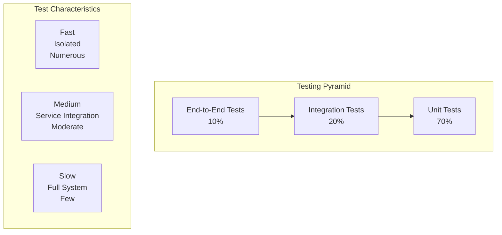
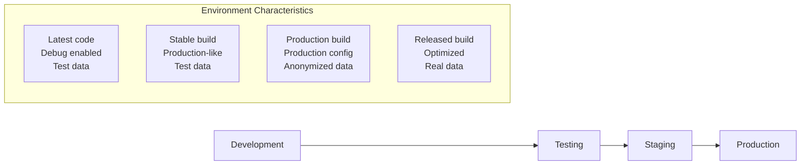
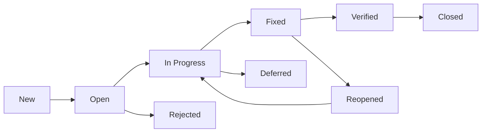

# Testing Strategy

**Version:** v1.0.0  
**Last Updated:** 2025-02-17  
**Author**: QA Team  
**Review Status**: Approved

## Overview

This document outlines the comprehensive testing strategy for the Transformation Coaching platform. It defines the testing approach, methodologies, tools, and processes to ensure the delivery of high-quality software that meets all functional and non-functional requirements.

## Testing Objectives

### Primary Objectives

1. **Defect Prevention**: Identify and fix defects early in the development cycle
2. **Quality Assurance**: Ensure the software meets all requirements
3. **Risk Mitigation**: Reduce production risks through thorough testing
4. **User Satisfaction**: Deliver a product that meets or exceeds user expectations
5. **Compliance**: Ensure adherence to security and regulatory requirements

### Secondary Objectives

1. **Performance Validation**: Verify performance requirements are met
2. **Accessibility Assurance**: Ensure WCAG 2.1 AA compliance
3. **Security Verification**: Validate security controls are effective
4. **Documentation**: Maintain comprehensive test documentation

## Testing Pyramid



## Testing Levels

### 1. Unit Testing

**Purpose**: Validate individual components and functions in isolation

**Scope**:
- Business logic functions
- Utility functions
- Component rendering
- API endpoint handlers
- Data transformations

**Tools**:
- Backend: pytest with Python
- Frontend: Jest with React Testing Library
- Coverage: pytest-cov, jest --coverage

**Requirements**:
- Minimum 80% code coverage
- All critical paths covered
- Edge cases tested
- Error conditions validated

**Example Test Structure**:
```python
# Backend unit test
class TestUserService:
    def test_create_user_success(self):
        # Arrange
        user_data = {
            "email": "test@example.com",
            "password": "SecurePass123!",
            "full_name": "Test User"
        }
        
        # Act
        user = user_service.create_user(user_data)
        
        # Assert
        assert user.email == user_data["email"]
        assert user.is_active is True
        assert user.hashed_password != user_data["password"]

# Frontend unit test
describe('Button Component', () => {
  it('renders with correct text', () => {
    render(<Button>Click me</Button>);
    expect(screen.getByRole('button', { name: 'Click me' })).toBeInTheDocument();
  });
  
  it('calls onClick when clicked', () => {
    const handleClick = jest.fn();
    render(<Button onClick={handleClick}>Click me</Button>);
    
    fireEvent.click(screen.getByRole('button'));
    expect(handleClick).toHaveBeenCalledTimes(1);
  });
});
```

### 2. Integration Testing

**Purpose**: Test interactions between components and services

**Scope**:
- API endpoint integration with database
- Component integration with API
- Service layer integration
- Database operations
- External API integrations

**Tools**:
- Backend: pytest with test database
- Frontend: Jest with MSW (Mock Service Worker)
- Database: pytest-asyncio
- External APIs: httpx with mocking

**Requirements**:
- All API endpoints tested
- Database operations validated
- Error handling verified
- Performance benchmarks

**Example Test Structure**:
```python
# API integration test
async def test_user_registration_integration(client, db_session):
    # Arrange
    user_data = {
        "email": "test@example.com",
        "password": "SecurePass123!",
        "full_name": "Test User"
    }
    
    # Act
    response = await client.post("/api/v1/auth/register", json=user_data)
    
    # Assert
    assert response.status_code == 201
    assert response.json()["email"] == user_data["email"]
    
    # Verify in database
    user = await db_session.get(User, response.json()["id"])
    assert user is not None
```

### 3. End-to-End Testing

**Purpose**: Test complete user workflows from start to finish

**Scope**:
- Critical user journeys
- Cross-browser compatibility
- Mobile responsiveness
- Performance under load
- Accessibility scenarios

**Tools**:
- Framework: Cypress
- Browsers: Chrome, Firefox, Safari, Edge
- Mobile: Cypress mobile emulation
- Visual: Percy or Chromatic
- Performance: Lighthouse CI

**Requirements**:
- All critical paths tested
- Cross-browser coverage
- Mobile scenarios covered
- Performance thresholds met
- Accessibility compliance verified

**Example Test Structure**:
```typescript
// E2E test example
describe('Coach Workflow', () => {
  beforeEach(() => {
    cy.login('coach@example.com', 'password');
  });
  
  it('should share workout with athlete', () => {
    // Navigate to workouts
    cy.get('[data-testid="workouts-nav"]').click();
    
    // Select workout
    cy.get('[data-testid="workout-item"]').first().click();
    cy.get('[data-testid="select-workout"]').click();
    
    // Choose athlete
    cy.get('[data-testid="athlete-select"]').click();
    cy.get('[data-testid="athlete-option"]').first().click();
    
    // Share workout
    cy.get('[data-testid="share-button"]').click();
    cy.get('[data-testid="success-message"]').should('be.visible');
  });
});
```

## Testing Types

### 1. Functional Testing

**Objective**: Verify the software meets functional requirements

**Activities**:
- Requirement validation
- Feature testing
- Regression testing
- User acceptance testing

**Test Cases**:
- Positive scenarios (happy paths)
- Negative scenarios (error conditions)
- Boundary value analysis
- Equivalence partitioning

### 2. Performance Testing

**Objective**: Ensure performance requirements are met

**Types**:
- Load Testing: Normal expected load
- Stress Testing: Beyond capacity limits
- Endurance Testing: Sustained load over time
- Spike Testing: Sudden load increases

**Tools**:
- k6 for load testing
- Lighthouse for performance metrics
- WebPageTest for analysis
- New Relic for monitoring

**Metrics**:
- Response times
- Throughput
- Resource utilization
- Error rates

### 3. Security Testing

**Objective**: Identify and address security vulnerabilities

**Types**:
- Authentication testing
- Authorization testing
- Data validation testing
- Penetration testing

**Tools**:
- OWASP ZAP for scanning
- Burp Suite for penetration testing
- Nessus for vulnerability scanning
- Custom security test suites

### 4. Accessibility Testing

**Objective**: Ensure WCAG 2.1 AA compliance

**Types**:
- Automated testing with tools
- Manual keyboard navigation
- Screen reader testing
- Color contrast verification

**Tools**:
- axe-core for automated testing
- WAVE for evaluation
- Screen readers (NVDA, VoiceOver)
- Color contrast analyzers

### 5. Usability Testing

**Objective**: Evaluate user experience and interface design

**Methods**:
- User observation
- Task completion rates
- Satisfaction surveys
- A/B testing

**Metrics**:
- Task success rate
- Time on task
- Error rate
- User satisfaction score

## Test Environment Strategy

### Environment Types



### Environment Management

**Development Environment**:
- Latest code from main branch
- Debug logging enabled
- Hot reload for rapid development
- Local test database

**Testing Environment**:
- Automated deployment from CI/CD
- Isolated from production
- Test data fixtures
- Performance monitoring

**Staging Environment**:
- Production-identical configuration
- Anonymized production data
- Full feature set enabled
- Security scanning

**Production Environment**:
- Blue-green deployment
- Canary releases
- Real-time monitoring
- Automated rollback

## Test Data Management

### Data Categories

1. **Static Test Data**
   - Pre-defined test datasets
   - Edge case data
   - Performance test data
   - Localization data

2. **Dynamic Test Data**
   - Generated at per test
   - Unique identifiers
   - Randomized values
   - Time-based data

3. **Sensitive Data**
   - Encrypted production data
   - PII anonymization
   - GDPR compliance
   - Secure handling

### Data Strategy

```python
# Test data factory
class UserFactory(factory.Factory):
    class Meta:
        model = User
    
    email = factory.Faker('email')
    full_name = factory.Faker('name')
    password = factory.PostGenerationMethodCall('set_password', 'TestPass123!')
    is_active = True
    is_verified = True

# Dynamic data generation
@pytest.fixture
def create_test_user():
    def _create_user(**overrides):
        return UserFactory(**overrides)
    return _create_user
```

## Test Automation Strategy

### CI/CD Integration

```yaml
# GitHub Actions workflow
name: Test Suite

on: [push, pull_request]

jobs:
  test-backend:
    runs-on: ubuntu-latest
    services:
      postgres:
        image: postgres:15
        env:
          POSTGRES_PASSWORD: test
        options: >-
          --health-cmd pg_isready
          --health-interval 10s
          --health-timeout 5s
          --health-retries 5
    
    steps:
      - uses: actions/checkout@v3
      - uses: actions/setup-python@v4
        with:
          python-version: '3.11'
      
      - name: Install dependencies
        run: |
          pip install -r requirements.txt
          pip install -r requirements-test.txt
      
      - name: Run tests
        run: |
          pytest --cov=app --cov-report=xml
      
      - name: Upload coverage
        uses: codecov/codecov-action@v3

  test-frontend:
    runs-on: ubuntu-latest
    steps:
      - uses: actions/checkout@v3
      - uses: actions/setup-node@v3
        with:
          node-version: '18'
      
      - name: Install dependencies
        run: npm ci
      
      - name: Run tests
        run: npm test -- --coverage --watchAll=false
      
      - name: Run E2E tests
        run: npm run test:e2e

  security-scan:
    runs-on: ubuntu-latest
    steps:
      - uses: actions/checkout@v3
      - name: Run security scan
        run: |
          pip install bandit safety
          bandit -r app/
          safety check
```

### Test Execution Strategy

1. **Pre-commit Hooks**
   - Linting
   - Unit tests
   - Type checking
   - Security scanning

2. **Commit Stage**
   - All unit tests
   - Integration tests
   - Code coverage
   - Static analysis

3. **Integration Stage**
   - API integration tests
   - Database tests
   - Performance tests
   - Security tests

4. **E2E Stage**
   - Full user journeys
   - Cross-browser tests
   - Mobile tests
   - Accessibility tests

## Test Reporting and Metrics

### Coverage Metrics

```python
# Coverage configuration
[tool:pytest]
addopts = 
    --cov=app
    --cov-report=html
    --cov-report=xml
    --cov-report=term-missing
    --cov-fail-under=80

# Coverage categories
coverage_categories = {
    "unit_tests": 70,
    "integration_tests": 20,
    "e2e_tests": 10
}
```

### Quality Metrics Dashboard

| Metric | Target | Current | Trend |
|--------|--------|---------|-------|
| Code Coverage | 80% | 85% | ↑ |
| Test Pass Rate | 95% | 98% | ↑ |
| Defect Density | <1/KLOC | 0.5/KLOC | ↓ |
| Automation Rate | 80% | 85% | ↑ |
| Mean Time to Test | 30min | 25min | ↓ |

### Reporting Tools

- **Allure**: Interactive test reports
- **SonarQube**: Code quality metrics
- **Grafana**: Real-time dashboards
- **Jira**: Test case management
- **TestRail**: Test execution tracking

## Risk-Based Testing

### Risk Assessment Matrix

| Risk | Probability | Impact | Mitigation |
|------|-------------|--------|------------|
| Garmin API failure | Medium | High | Mock services, retry logic |
| Database performance | Low | High | Load testing, optimization |
| Security breach | Low | Critical | Security testing, audits |
| Mobile compatibility | Medium | Medium | Device testing, responsive design |
| Accessibility issues | Low | Medium | Automated scans, manual testing |

### Test Prioritization

1. **Critical**: Core functionality, security, payment processing
2. **High**: User workflows, performance, accessibility
3. **Medium**: Edge cases, UI polish, nice-to-have features
4. **Low**: Experimental features, future functionality

## Defect Management

### Defect Lifecycle



### Defect Classification

**Severity Levels**:
- Critical: System crash, data loss, security breach
- High: Major functionality broken, performance issues
- Medium: Workaround exists, minor functionality issues
- Low: Cosmetic issues, documentation errors

**Priority Levels**:
- P1: Fix immediately
- P2: Fix in next release
- P3: Fix when time permits
- P4: Consider for future

## Testing Best Practices

### General Practices

1. **Test Early, Test Often**
   - Shift-left testing approach
   - Test-driven development (TDD)
   - Continuous integration

2. **Write Maintainable Tests**
   - Clear test names
   - Single assertion per test
   - Avoid test interdependence
   - Use page objects pattern

3. **Automate Where Possible**
   - Repetitive tasks automated
   - Manual testing for exploratory
   - ROI-driven automation

4. **Review and Refactor**
   - Regular test reviews
   - Remove flaky tests
   - Update tests with code changes

### Backend Testing Best Practices

```python
# Best practices example
class TestUserAPI:
    @pytest.fixture
    def client(self):
        return TestClient(app)
    
    @pytest.fixture
    def auth_headers(self, client):
        # Create and login user
        response = client.post("/api/v1/auth/login", json={
            "email": "test@example.com",
            "password": "TestPass123!"
        })
        token = response.json()["access_token"]
        return {"Authorization": f"Bearer {token}"}
    
    def test_get_profile_unauthorized(self, client):
        response = client.get("/api/v1/auth/me")
        assert response.status_code == 401
    
    def test_get_profile_success(self, client, auth_headers):
        response = client.get("/api/v1/auth/me", headers=auth_headers)
        assert response.status_code == 200
        assert "email" in response.json()
```

### Frontend Testing Best Practices

```typescript
// Best practices example
describe('User Dashboard', () => {
  const renderDashboard = () => {
    return render(
      <AuthProvider>
        <Dashboard />
      </AuthProvider>
    );
  };
  
  beforeEach(() => {
    // Mock API calls
    jest.spyOn(api, 'getUserData').mockResolvedValue(mockUserData);
  });
  
  it('displays user information', async () => {
    renderDashboard();
    
    await waitFor(() => {
      expect(screen.getByText('John Doe')).toBeInTheDocument();
    });
  });
  
  it('handles API errors gracefully', async () => {
    api.getUserData.mockRejectedValue(new Error('API Error'));
    
    renderDashboard();
    
    await waitFor(() => {
      expect(screen.getByText('Failed to load data')).toBeInTheDocument();
    });
  });
});
```

## Continuous Improvement

### Test Process Review

1. **Weekly Test Metrics Review**
   - Coverage trends
   - Test execution times
   - Flaky test identification
   - Automation effectiveness

2. **Monthly Retrospective**
   - Process improvements
   - Tool evaluation
   - Training needs
   - Best practice updates

3. **Quarterly Strategy Review**
   - Test strategy alignment
   - Resource allocation
   - Technology updates
   - Risk assessment

### Innovation and Research

- Explore new testing tools
- Implement AI in testing
- Research test automation frameworks
- Evaluate performance testing approaches
- Monitor industry best practices

## Documentation

### Required Documentation

1. **Test Plan**
   - Scope and objectives
   - Test strategy
   - Resource requirements
   - Schedule and milestones

2. **Test Cases**
   - Detailed test steps
   - Expected results
   - Pre-conditions
   - Test data requirements

3. **Test Reports**
   - Execution summary
   - Defect summary
   - Coverage metrics
   - Recommendations

4. **Test Standards**
   - Coding standards
   - Naming conventions
   - Review processes
   - Quality gates

## Training and Knowledge Sharing

### Training Topics

1. **Testing Fundamentals**
   - Testing principles
   - Test design techniques
   - Tool usage
   - Best practices

2. **Tool-Specific Training**
   - Cypress for E2E testing
   - Jest for unit testing
   - Performance testing tools
   - Security testing tools

3. **Domain Knowledge**
   - Application architecture
   - Business processes
   - Integration points
   - Risk areas

### Knowledge Sharing

- Weekly testing meetings
- Brown bag sessions
- Documentation updates
- Pair testing sessions
- Cross-team collaboration
